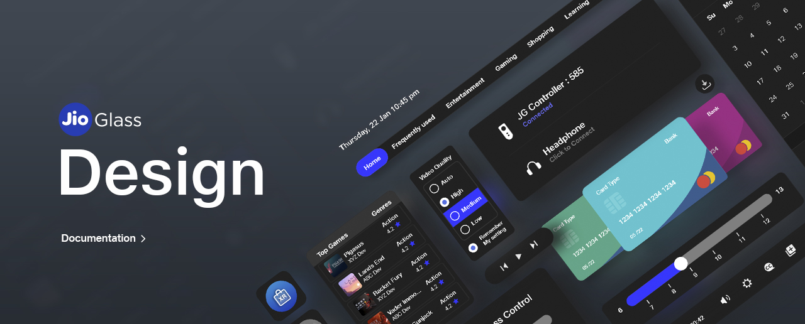
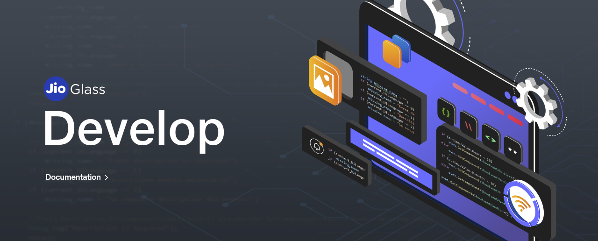

# Tesseract Mixed Reality Knowledge Base

## [Introduction to Mixed Reality Design System](https://docs.tesseract.in/design/)

**Mixed Reality (MR**) is a blend of physical and virtual worlds, where user can interact designs virtual in a physical world. The Jio Mixed Reality Design and Interaction system is created to help designers, developers and product owners to build high-quality digital experiences in MR (Mixed Reality) that aim to create a delightful, engaging and consistent digital experiences for our users and developers love across all digital touch-points.&#x20;

This design system is inspired from elements in the real world incorporating various physical and environmental factors such as light, shadows, reflection and motion.

[Explore Now](https://docs.tesseract.in/design/)

## [Introduction to Tesseract Mixed Reality Development](https://docs.tesseract.in/develop/)

**Mixed Reality (MR**) is a blend of physical and virtual worlds, where users can interact with designs virtual in a physical world. The Jio Mixed Reality Software Development Kit is created to help developers embark on this journey to build high-quality digital experiences in MR (Mixed Reality) that aim to create a delightful, engaging, and consistent digital experiences for our users and developers love across all digital touch-points.&#x20;

The documentation provides a step-by-step guide to develop applications on the Jio Mixed Reality System. So hurry up and...

[Explore Now](https://docs.tesseract.in/develop/)

