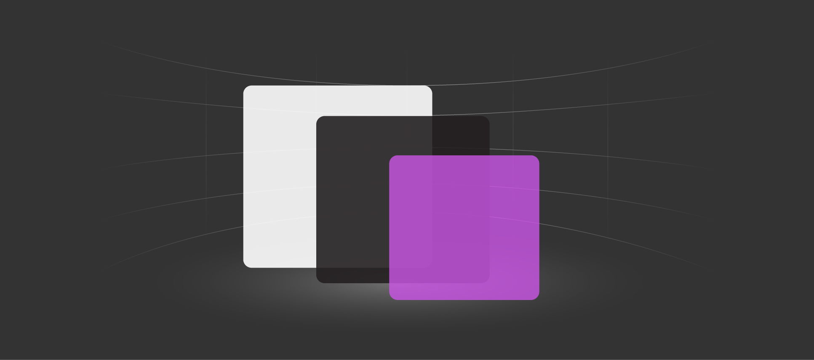

# Design and Interaction System

**Mixed Reality (MR**) is a blend of physical and virtual worlds, where user can interact designs virtual in a physical world. The Jio Mixed Reality Design and Interaction system is created to help designers, developers and product owners to build high-quality digital experiences in MR (Mixed Reality) that aim to create a delightful, engaging and consistent digital experiences for our users and developers love across all digital touch-points.&#x20;

This design system is inspired from elements in the real world incorporating various physical and environmental factors such as light, shadows, reflection and motion.

## Principles 

* Float
* Depth
* Motion

### Float

Float/Parallax is a component that adds motion, depth, and scale to your app.

In a UI, you can create a parallax effect by moving different objects at different rates when the UI scrolls or pans. To demonstrate, let's look at two layers of content, a list and a background image. The list is placed on top of the background image which already gives the illusion that the list might be closer to the viewer. Now, to achieve the parallax effect, we want the object closest to us to travel "faster" than the object that is farther away. As the user scrolls the interface, the list moves at a faster rate than the background image, which creates the illusion of depth.

### Depth

In the physical world, we tend to focus on objects that are closer to us. We can apply this spatial instinct to digital UI as well. For example, if you bring an element closer to the user, then the user will instinctively focus on the element.

Shadow is one way a user perceives elevation. Light above an elevated object creates a shadow on the surface below. The higher the object, the larger and softer the shadow becomes. Elevated objects in your UI don’t need to have shadows, but they help create the appearance of elevation.

### Motion

Motion serves a purpose in any application. It gives intelligent feedback based on the user's behavior, keeps the UI feeling alive, and guides the user's navigation through your app. Motion elicits an emotional connection between a user and their digital experience. We build on a foundation of natural movement the user already understands from the physical world, and we extend our system from there.

