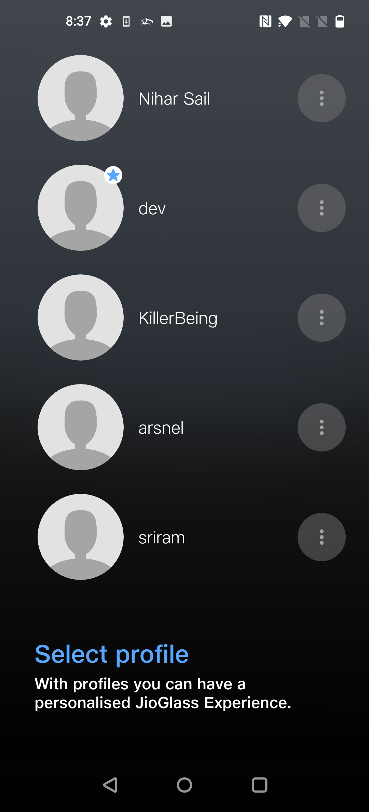

# Companion App For Jio Mixed Reality (JMR) Devices

Setting Up The Companion App

* Download the latest **JioGlass** android application package (.apk).
* Install this downloaded application on the testing device which you will be using for further debugging.

## Setting up the JioGlass App

Allow all the permissions required.

.png>)

Then Allow the JioGlass App to allow display over other apps, permit usage access, and allow app installation from this source.

<figure><figcaption></figcaption></figure>

Then press on **Login** Button.

Enter 'developer@tesseract.in' as the email id and the 'JioGlass@123' as a password

Create a profile or select a previously created profile

Change the Device from the top right corner

then click on the controller button to connect with the controller

Pair your controller using controller button.


If you got any "Switch on location" and your device location is switched on then restart your JioGlass app after clearing it from the android recent.


Now press the home button of the controller to show the launcher.

Enjoy!

