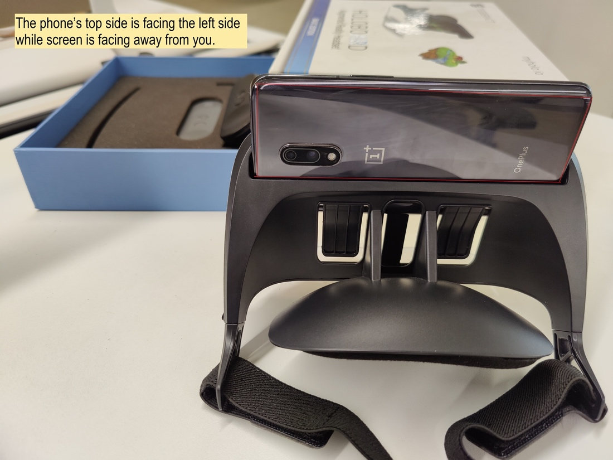

# Running the application on Prism (Holoboard)

## Running the Application on Holoboard

* Run the build on your Android Device.
* Insert your phone into the **Holoboard** such that the phone’s top side is facing the left side while the screen is facing away from you.

* Enjoy.
