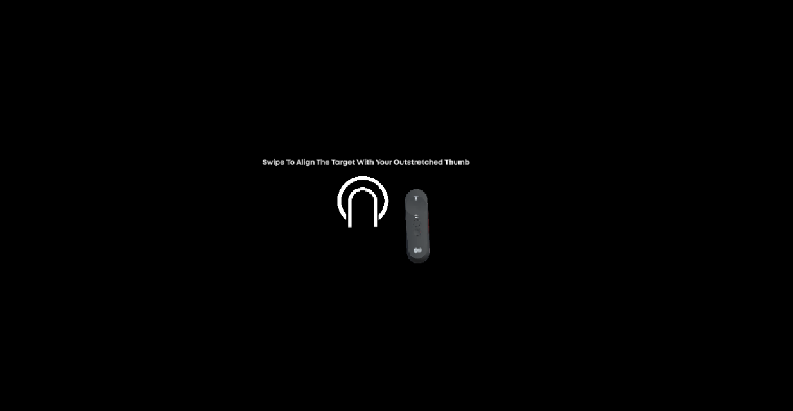

# IPD Calibration

IPD stands for **Inter-Pupillary Distance**, which is the distance between your eyes. Since JioGlass Emulator (Holoboard) and JioGlass are stereoscopic displays, having an incorrect IPD might lead to multiple issues, such as image doubling, blurry visuals or incorrect depth perception of your objects in the scene. To ensure that you don't face any such issues or that you can verify the depth placement of your objects in the scene properly, please perform the steps given below to calibrate your IPD while testing.


This step will be performed automatically for consumers, as part of the onboarding experience so you don't have to urge the user to perform this step in your application separately.


If dual images or blurred visuals are visible on the **JioGlassEmulator**, it is because **IPD** has not been set properly for your eyesight. Following are the steps to change the **IPD** settings.

## **IPD Calibration**


_In JioDive, there is a physical slider to calibrate the IPD. (Please ask the **Developer Support** team for Images or References._


In Launcher, go to the settings panel, under "My Profile" click on the **Change** button.

 (1).png>)

After clicking on the **Change** button, an instruction card for changing the IPD value will appear

.png>)

* Press the **Trigger** once to enter the IPD Calibration mode
* On this screen, you will be asked to stretch your hand out with the thumb pointed upwards.
* Then you will have to swipe up or down on the controller until you see no blurred or dual images.
* Once done, press the **Trigger** button again to close the screen and set your IPD

