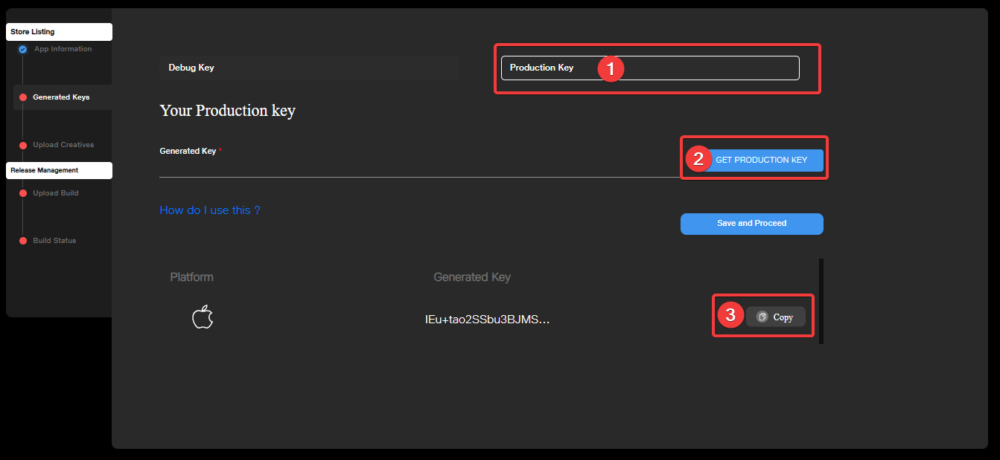

# Licensing Journey in iOS JioImmerse

## Overview

To create a licensed application in iOS, the following steps have to be performed.

1. Get the application ready in xCode as mentioned in [Publishing to Apple Store page](../publish/publishing-to-apple-store.md).
2. Get the production key from the JioImmerse Developer Console.
3. Goto xCode and open info.plist.
4. Create a new field with the name `LICENSING_KEY` and enter the value of the production key.
5. Your application is now licensed. Publish the application.

## Getting the iOS license key

Goto JioImmerse Developer Console and open your iOS application.&#x20;

<figure><figcaption></figcaption></figure>

Get the production key from the JioImmerse Developer Console.

<figure><figcaption></figcaption></figure>

## Entering the iOS license key in xCode.

Open your Project in xCode

Goto Info.plist in Unity-iPhone

Create a new field and name it as `LICENSING_KEY`

Enter the Production Key that you got from the JioImmerse Developer Console as the value for the `LICENSING_KEY` field.

<figure><figcaption></figcaption></figure>

Build and upload your application to Apple Store Connect and JioImmerse Developer Console.\
Once the application is approved from both ends, the license key will work.
