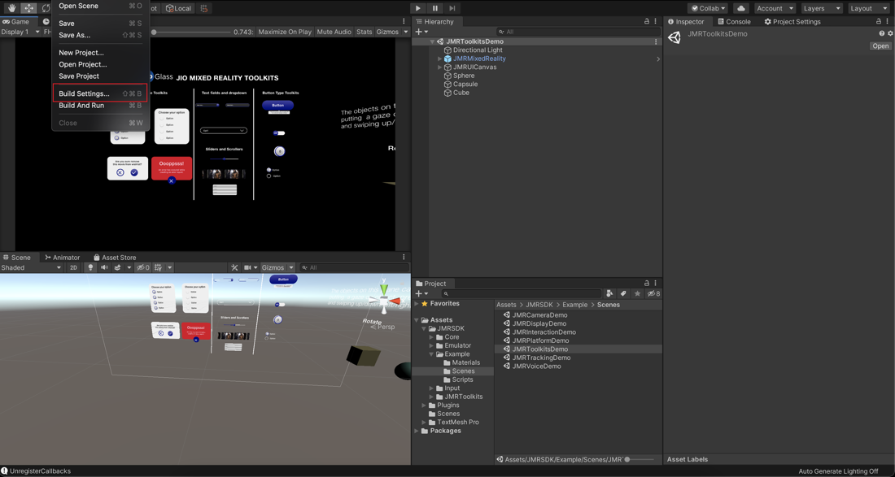
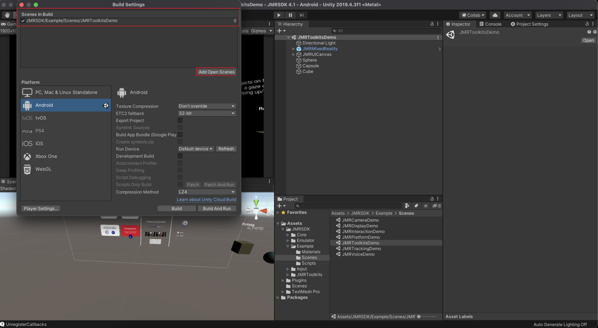
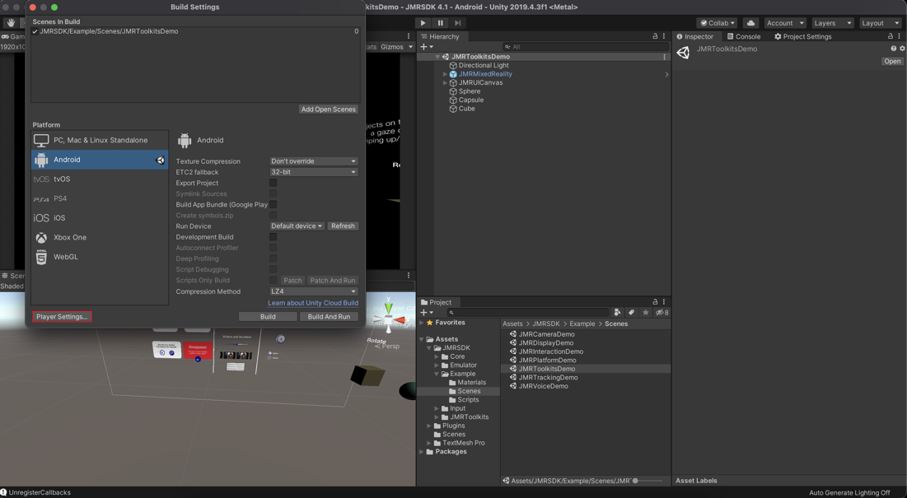
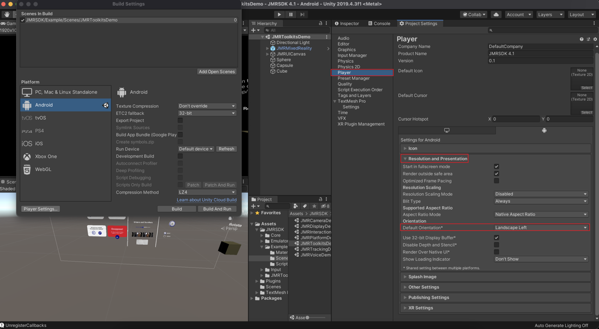
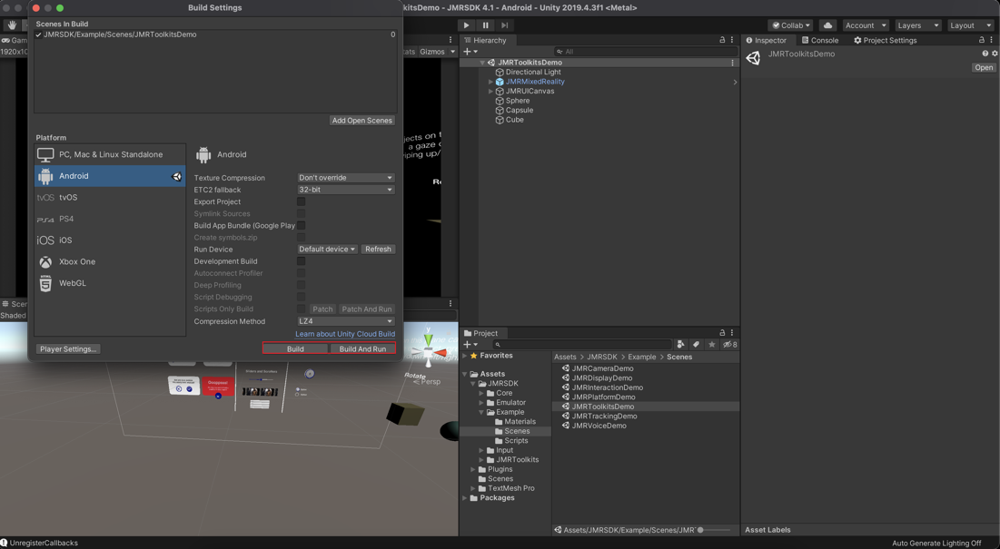

# Building to Target Device

This section will look at the steps to build your application Android Manifest.

## Configuring your Project Manifest

Select your target device type from JioMixedReality -> Manifest -> Show Asset&#x20;

<figure><figcaption></figcaption></figure>

This will create and open SO\_JMR\_Manifest in Inspector that has to be set up for your project.

### Setting Device Type

In SO\_JMR\_Manifest -> Device Type and then select your target devices -> Press UPDATE

<figure><figcaption></figcaption></figure>

### Configuring Interaction in AndroidManifest

Select all the interactions that the build application will support.

<figure><figcaption></figcaption></figure>

### Adding Category Tag In AndroidManifest

Select the category to which the application belongs.

<figure><figcaption></figcaption></figure>

#### Alternative: Manual Method

Find the value corresponding to your application category from the table below -&#x20;

| Category            | Value |
| ------------------- | ----- |
| Entertainment       | 0     |
| Gaming              | 1     |
| Learning            | 2     |
| Productivity        | 3     |
| Utilities           | 4     |
| Health and Wellness | 5     |
| Shopping            | 6     |
| Miscellaneous       | 7     |

* Edit the "android:value" parameter in the following line in your AndroidManifest to reflect your JioGlass Lite Application in the right category. Ensure that you use the same category as used in Developer Console while creating your application listing


```markup
<meta-data android:name="com.jiotesseract.mr.category" android:value="1" />
```


## Licensing Journey


[licensing-journey-in-android-jioimmerse.md](../licensing-journey-in-android-jioimmerse.md)



[licensing-journey-in-ios-jioimmerse.md](../licensing-journey-in-ios-jioimmerse.md)


## Setting up Unity for Target Device

* Go to **File -> Build Settings** to open the **Build Settings** dialogue box.



* In Platform under Build Settings, Choose **Android** and click on **Switch Platform** if not done already as the destination platform.


* Ensure your scene(s) are added to the **Scenes in the Build** section. If not, then open your current scene(s) in the unity editor and click on Add Open Scenes under build settings. You can also drag and drop your scene into the build settings window.



* Click on **Player Settings** to configure the player settings for your target device.



### Player Settings

Ensure that your Target Device and the Development System are configured to build for Android.

#### Configure the Player Settings as shown below for Android Device

* Under the **Resolution and Presentation** tab, set the **Default Orientation** to **Landscape Left**.



* Under the **Other Settings** tab, set the **Graphics APIs** to **Vulkan,** **OpenGLES3, and OpenGLES2**.


This might differ if you are using URP, refer to [URP Support](../../getting-started/urp-support/).


<figure><figcaption></figcaption></figure>

* Under the **Other Settings** tab, set the **Minimum API Level** to **Android 9.0 (API Level 28)** or above and the **Target API Level** to **Android 14 (API Level 34)**.

<figure><figcaption></figcaption></figure>


Apply[ Performance optimization](performance-optimization.md) steps for building with the application on the latest arm64 architecture and get the best performance for your application


* Build the Application.


