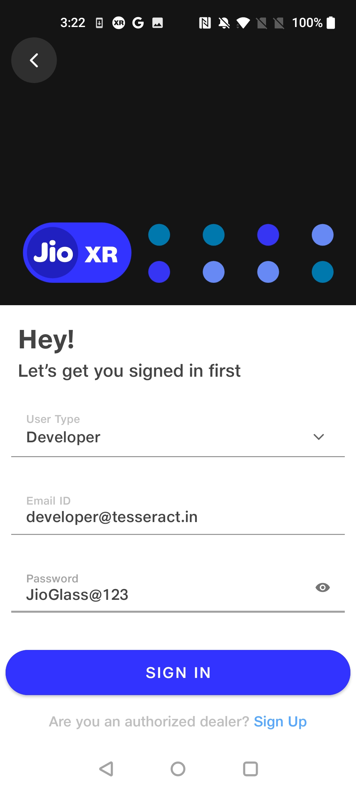
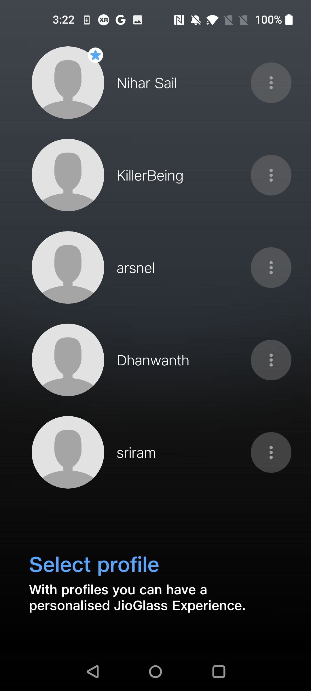
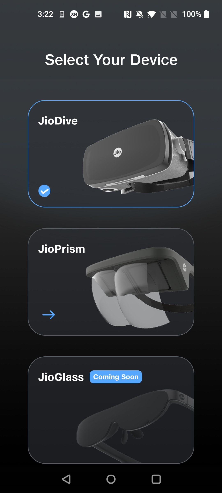

# JioImmerse App For Jio Mixed Reality (JMR) Devices

Setting Up The Companion App

* Download the latest **JioXR** android application package (.apk).
* Install this downloaded application on the testing device which you will be using for further debugging.

## Setting up the **JioXR** App

Allow all the permissions required.

.jpg>)

Then Allow the JioXR App to allow display over other apps, permit usage access, and allow app installation from this source.

<figure><figcaption></figcaption></figure>

Then press on **Login** Button.

Enter 'developer@tesseract.in' as the email id and the 'JioGlass@123' as a password

Create a profile or select a previously created profile

Select your device.

If you want to change your device type from the JioXR.

you can change it from upper right corner

Get JMR Apps under VR Apps tab.

Enjoy!

