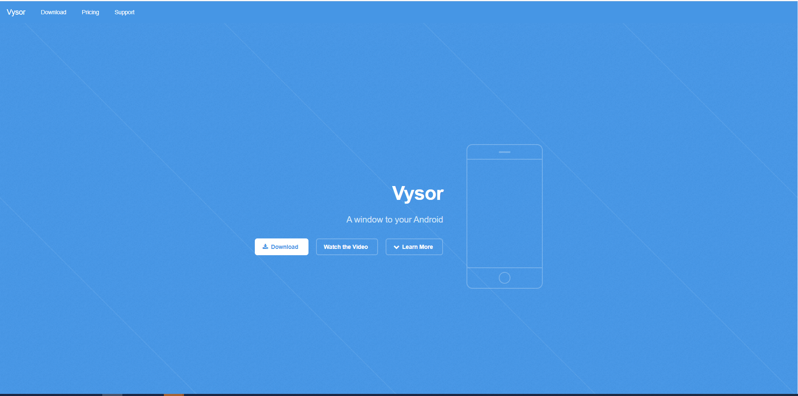
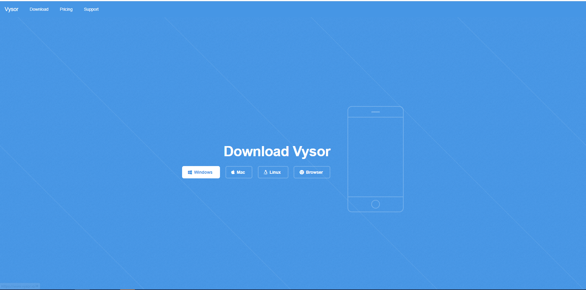
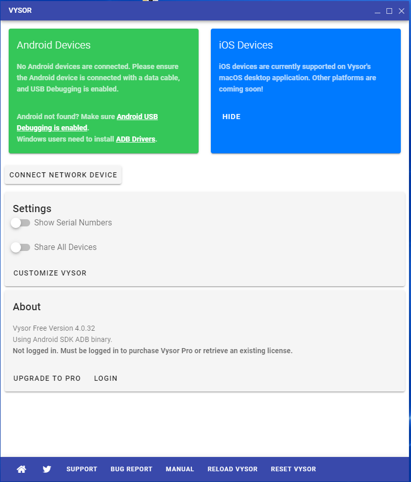
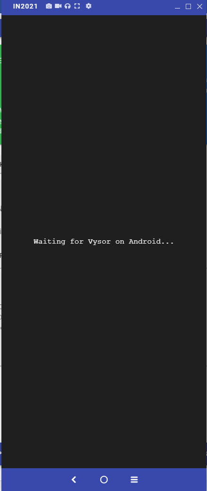

# Capturing Screenshot/Videos using Vysor

* Visit [https://www.vysor.io/](https://www.vysor.io/)

* Download Vysor for your machine OS (Windows/Mac/Linux)

* Once downloaded, install the Vysor on your machine.

* Once Vysor is installed, connect your android device to your machine

.PNG>)

* Your android device will be automatically detected by the Vysor. In case Android device not detected, follow these steps mentioned in this [**link**](https://support.vysor.io/technical/notfound/)
* Click on the View device icon (Play logo) visible in Infront of your android device model
* Now, wait for the process to complete, and once done, see that the device has been mirrored successfully.

* Start Companion app to start the services and open the apps made on JMRSDK from your phone or directly from the desktop machine
* Once done you will see the mirror happening on your desktop machine from where you can easily capture screenshots (Videos, toggle audio, wireless connect are pro features where you need to purchase the Vysor License)

.PNG>)

Note: In order to Vysor work, Android USB debugging should be enabled, ADB Drivers should be installed.
