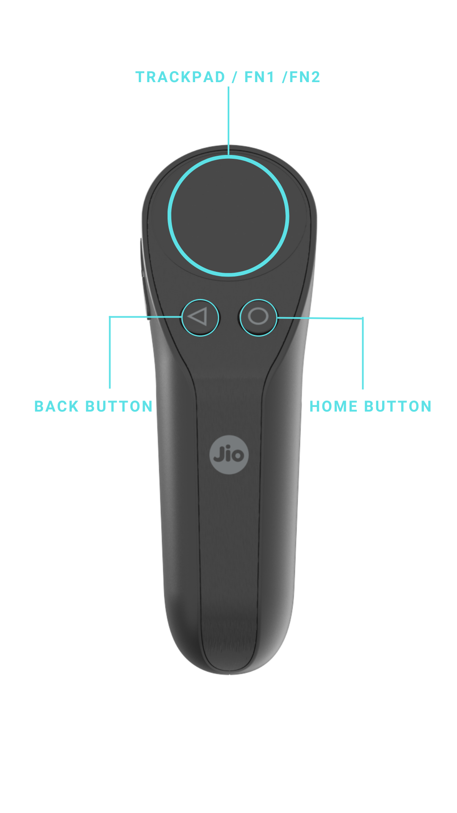
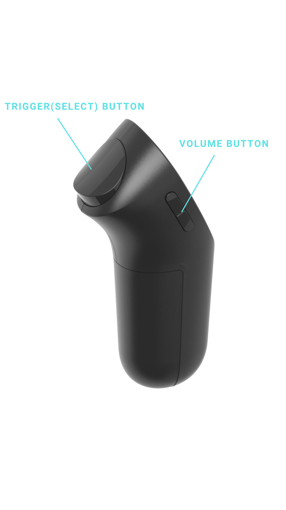

# Physical Controllers

There are multiple supported controllers for JioGlass Ecosystem.&#x20;

## JioGlass Controller V3


You should use JioGlass Controller V3 [controller's renders](https://tesseractpvt-my.sharepoint.com/:f:/g/personal/virendra_tesseract_in/EkPTcaNZcqVKhS9poTmNynIBrfQXXUFXMdH-61GrxEbR-w?e=Cp0Ixa) for adding to your application.


This controller is supported by Android 10, 11, 12. and 13.\
You can use this controller with JioPrism (Holoboard) and JioDive.

<figure><figcaption></figcaption></figure> <figure><figcaption></figcaption></figure>

## JioGlass Controller v2&#x20;

<figure><figcaption>
JioPrism Controller render
</figcaption></figure>

This controller is supported by Android 10, 11, 12, and 13. \
You can use this controller with JioPrism (Holoboard) and JioDive.

## JioGlass Controller  v1

This controller works with Android 11. \
You can use this controller with JioPrism (Holoboard) and JioDive.
