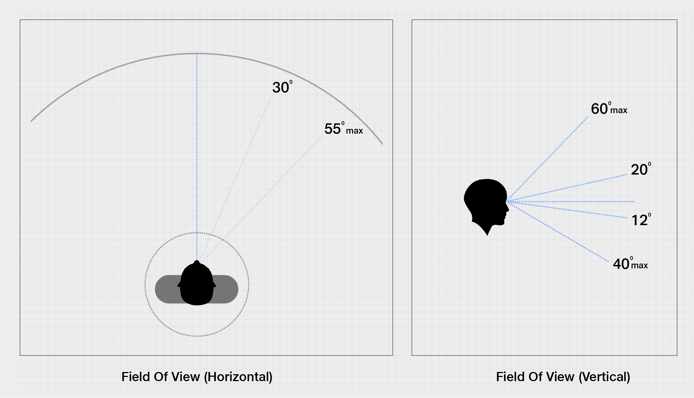
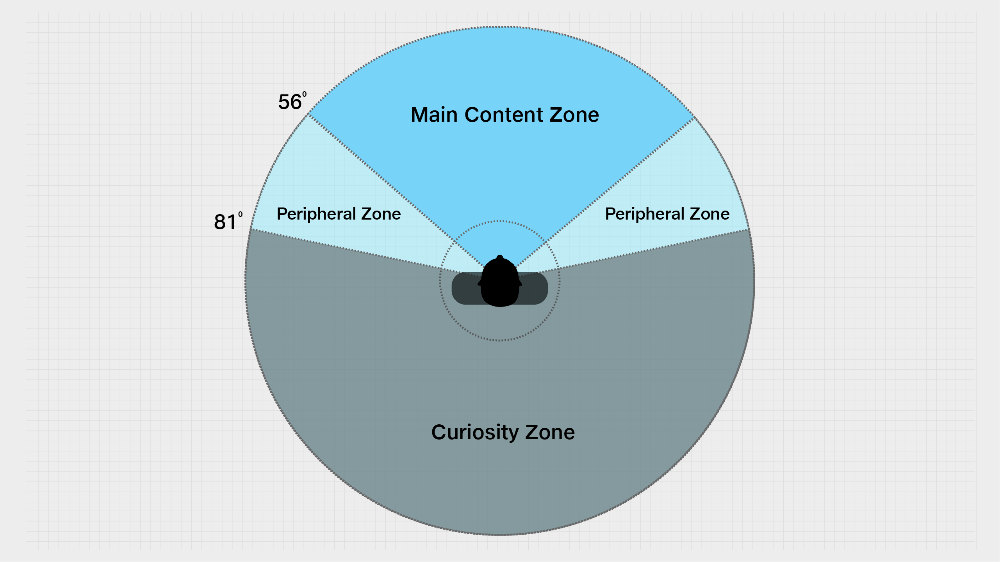
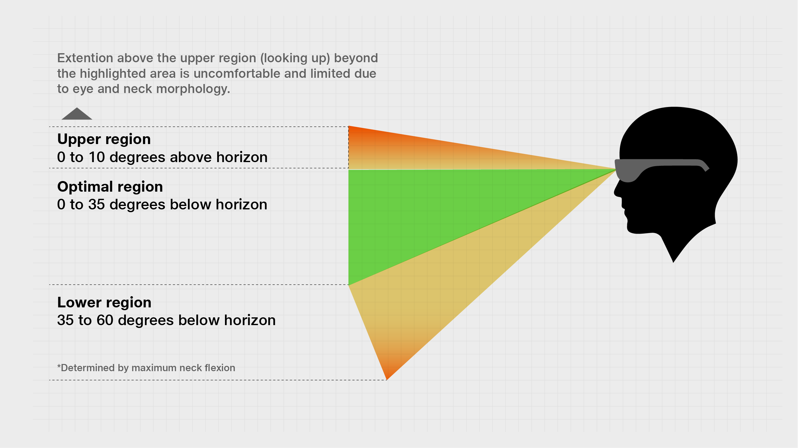
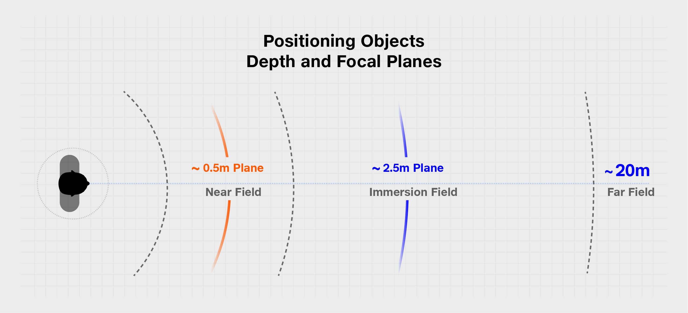
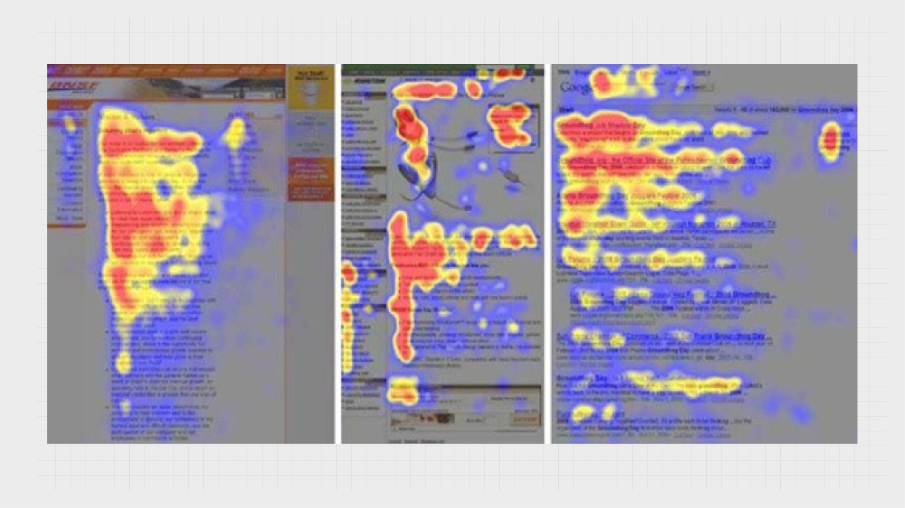
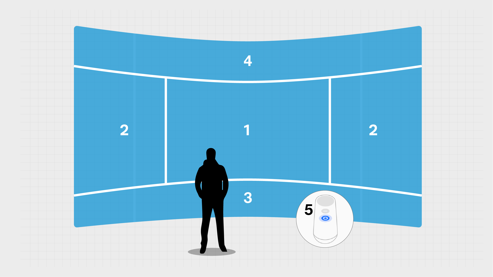

# Content Placement in Mixed Reality

Placement of content around the user is a conscious decision that can greatly enhance or degrade the user’s overall experience. Creative placement of content around the users can even encourage them to explore theirs surroundings in completely new ways!

## Content Placement – Field Of View Considerations​

* **Field Of View (Horizontal) -** ​A person can view content in a 30-degree range and can comfortably view up to a 55-degree range. _(Source: Alex Chu, ex-Head of Samsung VR)​_
* **Field Of View (Vertical) -** people can comfortably turn their heads 20 degrees up, while 60 degrees is the topmost. Moreover, people can turn their heads with the chin down. While 12 degrees is comfortable, the topmost is 40 degrees.

## Content Placement – Horizontal Content Zones​ 

We recommend the following horizontal division of the content zones for the most optimal user experience

* _**Main Content (-56 to +56 degrees)**_ ​- This region should be used for majority of the content​
* &#x200B;_**Peripheral Content (56 to 81 degrees)**_&#x200B; - This region should be used for anything extra that is scarcely used during the experience. It is recommended that you do not place important content in the peripheral zone., as it may be missed. ​
* &#x200B;_**Curiosity Zone**_ ​- Beyond that is the curiosity zone, where the user literally turns back (imagine a scene where the user has heard their name being called from the back).​

## Content Placement – Vertical Content Zones​ 

Tesseract recommends the following guidelines for a comfortable user experience based on content placement around the user along horizontal and vertical zones -


* **Avoid** gaze angles more than 10 degrees above the horizon (vertical movement)​
* **Avoid** gaze angles more than 60 degrees below the horizon (vertical movement)​
* **Avoid** neck rotations more than 45 degrees off-center (horizontal movement)


## Content Placement – Depth 


Tesseract recommends the following guidelines for placement of content along depth from the user for maximum depth perception -

* **Minimum Distance from User**​\
  Any content should be placed at least **0.5m** away from the user.​
* **Maximum Distance from User**​\
  Any content placed beyond **20m** loses its perception of depth and appears mostly 2D.​
* **Optimal zone for maximum depth perception**​\
  We recommend placing the content between 0.5m and 2.5m for optimal depth perception​


## **Content Placement - User Gaze Patterns**

### Smartphone / 2D Gaze Pattern​

On smartphones and web, users follow the “F-Shaped” gaze pattern wherein the users usually read the first line from left to right forming the top bar of F, followed by a shorter horizontal gaze, which forms the second shorter bar of F, and eventually break into a straight vertical gaze forming the stem of the letter F. This can be clearly seen in the middle image on the top left.​

### MR Gaze Pattern​

In MR, a user naturally first focuses on the centre of the experience, then looks around/sideways to make sense of the 3D environment, followed by looking down (maybe to see the surface below), followed by looking up (as we do not look up for answers, which may explain this delay), and lastly, looking at the controller in the hand.​


Tesseract recommends using the MR Gaze Pattern on the left to concentrate most content in regions numbered 1,&#x20;

