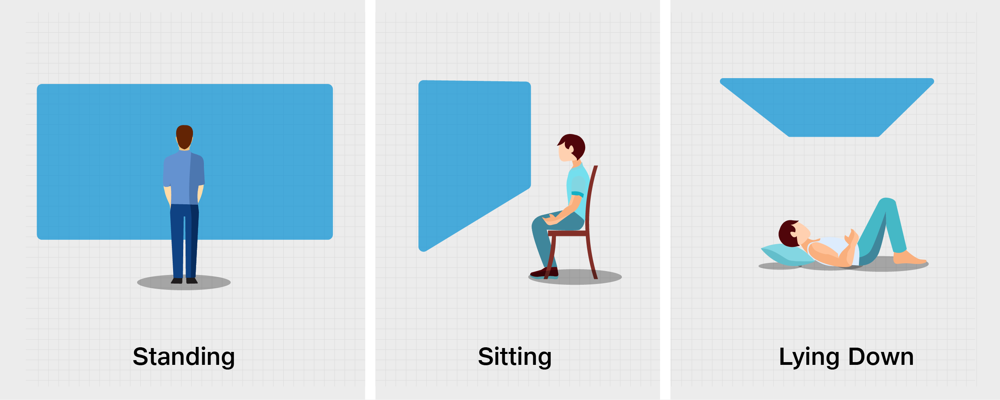

# User's State of Experience

The state of the user while consuming MR content is a very important factor to keep in mind while designing the User Interface as it can pose certain limitations that you can use to your advantage to direct user attention and drive user engagement.

Following are the most commonly seen states in which users consume immersive content

* Standing
* Sitting
* Lying Down

Statistically, long form content is mostly consumed while **sitting**.

According to the above mentioned states, Tesseract recommends making use of the following **content zones**, as described in the _Content Placement for MR_ section, for creating the most comfortable yet engaging user experiences in Mixed Reality as

## Standing 

* _**Main Content (-56 to +56 degrees)**_ ​- Use this zone for majority of the content
* &#x200B;_**Peripheral Content (56 to 81 degrees)**_&#x200B; - Use this zone for anything extra that involves the user to turn their head around
* &#x200B;_**Curiosity Zone (Behind the user)**_ ​- Use this zone very scarcely and only to encourage the user to explore and discover surprises or easter eggs that don’t otherwise affect the main storyline of the experience

## Sitting 

* _**Main Content (-56 to +56 degrees)**_ ​- Use this zone for majority of the content
* &#x200B;_**Peripheral Content (56 to 81 degrees)**_&#x200B; - Use this zone very scarcely and only to encourage the user to explore and discover surprises or easter eggs that don’t otherwise affect the main storyline of the experience
* &#x200B;_**Curiosity Zone (Behind the user)**_ ​- Don't use this zone as it will be extremely uncomfortable for the user to explore this section

## Lying Down 

* _**Main Content (-56 to +56 degrees)**_ ​- Use this zone for ALL of the content. This is the boundary of the experience and anything beyond this will most likely be missed by the user.
* &#x200B;_**Peripheral Content (56 to 81 degrees)**_&#x200B; - Don't use this zone as it will be extremely uncomfortable for the user to explore this section
* &#x200B;_**Curiosity Zone** &#x200B;**(Behind the user)**_- Don't use this zone as it will be impossible for the user to explore this section
