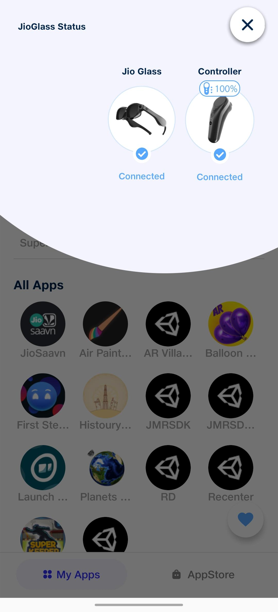
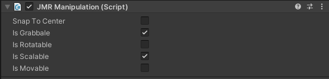
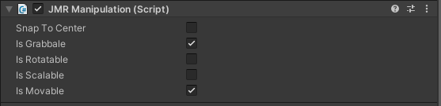

# Adding Interactions to Objects in the scene

There are two ways to add interactions to any object or UI in Jio Mixed Reality SDK.

* Using Interfaces
* Subscribing to actions in Interactable.

### Using Interfaces

* Add a **Cube** to the **JioGlass MR** Scene.
* Create a new script named **InterfaceExample.cs** and attach it to this **Cube**.
* Open **InterfaceExample** and replace its contents with the following.

```
/*Example to use Interfaces to add interaction of objects/UI*/

using JMRSDK.InputModule;
using UnityEngine;
public class InterfaceExample: MonoBehaviour, ISelectHandler,
  ISelectClickHandler, IFocusable, ISwipeHandler, ITouchHandler,
  IBackHandler, IMenuHandler, IVoiceHandler, IFn1Handler,
  IFn2Handler,IManipulationHandler {
  
  public void OnBackAction() {
    Debug.Log("OnBackAction");
  }
  
  public void OnFn1Action() {
    Debug.Log("OnFn1Action");
  }
  
  public void OnFn2Action() {
    Debug.Log("OnFn2Action");
  }
  
  public void OnFocusEnter() {
    Debug.Log("OnFocusEnter");
  }
  
  public void OnFocusExit() {
    Debug.Log("OnFocusExit");
  }
  
  public void OnManipulationCompleted(ManipulationEventData eventData) {
    Debug.Log("OnManipulationCompleted");
  }
  
  public void OnManipulationStarted(ManipulationEventData eventData) {
    Debug.Log("OnManipulationStarted");
  }
  
  public void OnManipulationUpdated(ManipulationEventData eventData) {
    Debug.Log("OnManipulationUpdated");
  }
  
  public void OnMenuAction() {
    Debug.Log("OnMenuAction");
  }
  
  public void OnSelectClicked(SelectClickEventData eventData) {
    Debug.Log("OnSelectClicked");
  }
  
  public void OnSelectDown(SelectEventData eventData) {
    Debug.Log("OnSelectDown");
  }
  
  public void OnSelectUp(SelectEventData eventData) {
    Debug.Log("OnSelectUp");
  }
  
  public void OnSwipeCanceled(SwipeEventData eventData) {
    Debug.Log("OnSwipeCanceled");
  }
  
  public void OnSwipeCompleted(SwipeEventData eventData) {
    Debug.Log("OnSwipeCompleted");
  }
  
  public void OnSwipeDown(SwipeEventData eventData, float delta) {
    Debug.Log("OnSwipeDown");
  }
  
  public void OnSwipeLeft(SwipeEventData eventData, float delta) {
    Debug.Log("OnSwipeLeft");
  }
  
  public void OnSwipeRight(SwipeEventData eventData, float delta) {
    Debug.Log("OnSwipeRight");
  }
  
  public void OnSwipeStarted(SwipeEventData eventData) {
    Debug.Log("OnSwipeStarted");
  }
  
  public void OnSwipeUp(SwipeEventData eventData, float delta) {
    Debug.Log("OnSwipeUp");
  }
  
  public void OnSwipeUpdated(SwipeEventData eventData, Vector2 delta) {
    Debug.Log("OnSwipeUpdated");
  }
  
  public void OnVoiceAction() {
    Debug.Log("OnVoiceAction");
  }
  
  public void OnTouchStart(TouchEventData eventData, Vector2 TouchData) {
    Debug.Log("OnTouchStarted " + TouchData.ToString());
  }
  
  public void OnTouchStop(TouchEventData eventData, Vector2 TouchData) {
    Debug.Log("OnTouchStop " + TouchData.ToString());
  }
  
  public void OnTouchUpdated(TouchEventData eventData, Vector2 TouchData) {
    Debug.Log("OnTouchUpdated " + TouchData.ToString());
  }
  
}
```

* As you can see, we have implemented some Interfaces in the above code. Let’s take a look at what each Interface does in brief.
  1. **ISelectHandler** – Interface to handle simple pointer inputs like **OnSelectDown** & **OnSelectUp**.
  2. **ISelectClickHandler** – Interface to handle simple click inputs.
  3. **IFocusable** – Interface to handle focus Enter/Exit.
  4. **ISwipeHandler** – Interface to handle swipe gestures.
  5. **ITouchHandler** – Interface to handler touch events on the trackpad.
  6. **ISpeechHandler** – Interface to handle speech recognition.
  7. **IHomeHandler** – Interface to handle **Home Button** interaction. Coming Soon!
  8. **IBackHandler** – Interface to handle **Back Button** interaction.
  9. **IMenuHandler** – Interface to handle **Menu Button** interaction.
  10. **IRecenterHandler** – Interface to handle **Recenter Button** interaction. Coming Soon!
  11. **IVoiceHandler** – Interface to handle **Voice Button** interaction.
  12. **IFn1Handler** – Interface to handle **Fn1 Button** interaction.
  13. **IFn2Handler** – Interface to handle **Fn2 Button** interaction.
  14. **IManipulationHandler** – Interface to handle object **Manipulation** interactions. In **Manipulation,** you can **grab** an object and then perform actions like **rotating**, **scaling,** or **dragging** it from one place to another.
* You can now play the scene and check for all the interactions.
* After playing, bring the **Pointer** on the **Cube** and press the interaction buttons.
* For every interaction, you will get a debug message in the console through the above code.


* As you can see, we have implemented all the Interfaces related to Interactions on objects in the **InterfaceExample** class.
* It is not mandatory to implement all the interfaces. You can implement the Interfaces only for the interactions you want.
* For e.g., if you want only **Swipe** interactions on the **Cube**, you will implement only the **ISwipeHandler** interface.
* These interactions are currently local, i.e., they can only be triggered on this **Cube** object.
* To make these interactions **Global** to trigger them from anywhere, add the following line to the **Start** function of the **InterfaceExample** script.

```
JMRInputManager.Instance.AddGlobalListener(gameObject);
```

If you now play the scene, you don’t have to focus the **Reticle** on the **Cube** anymore. You can focus anywhere and test the Interactions.

### Using Jio Mixed Reality UI Toolkits

1. Add the **Canvas** Toolkit to a **JMR** configured scene **(JioMixedReality -> UI -> Canvas)**.
2. With the **Canvas** selected, add a **Button** Toolkit to the scene **(JioMixedReality -> UI -> Button)**.


* Now add a **Sphere** to the scene and position it to **(0, -1.5, 10)**. **Deactivate** the **Sphere**.
* Drag this **Sphere** to the **OnButtonClick** event on the **JMRUIButton** script on the **Button** and set its onclick event to activate the **Sphere** as shown below:


.png>)

* You can now play the scene and interact with the **Button**. Clicking on the **Button** activates the **Sphere**.

.png>)

* You can see the **Button** animate when we focus on it or click it. These animations are handled by the **JMRThemeAnimator** script attached to the **Button**.
* Similarly, you can interact with other UI Toolkits by adding them to the scene and making use of the exposed members on the scripts attached.

### Direct Manipulation of 3D GameObjects

1. Add a **Cube**, a **Sphere,** and a **Capsule** to a **JMRSDK** configured scene and position them as shown in the image below.
2. Attach **JMRManipulation** script to these 3 objects.
3. On the **JMRManipulation** script on each of these objects, select the options as shown belo&#x77;**:**

* **Cube**: **IsRotatable**
* **Sphere**: **IsGrabable**, **IsScalable**
* **Capsule**: **IsGrabable**, **IsMovable**







* Now play the scene and point the ray on the **Sphere**. Start the **Manipulation** action by long-pressing the **Trigger** button.
* The **Sphere** will snap to the pointer. Now you can **Scale** the **Sphere** by swiping the trackpad.
* Repeat the same process with **Cube** and it will **Rotate** when you swipe on the trackpad.
* Repeat the same process with **Capsule** and you will be able to **Move** the **Capsule** around the scene.
* **SnapToCenter** option on **JMRManipulation** script is an experimental feature. Selecting this option will snap the pointer ray to the **Center** of that object.


