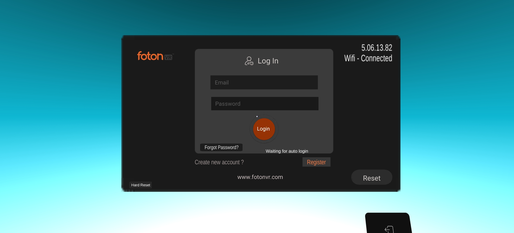

# Cameras

There are 4 cameras in the JMRMixedReality prefab.

.png>)


The **head** camera is tagged as the main camera and is disabled when running on target device, hence if you are using `Camera.main` in your application, it will return with a null reference exception.


## Rendering from cameras

The head camera renders the application in 2d mono view in the unity editor.

Left and right cameras render the application in 3d stereo view on the target device.

POV camera is used for casting your application to other devices.&#x20;

<figure><figcaption><p>Mono View - Covers the entire screen - Usually rendered by the main *head* camera in unity editor.</p></figcaption></figure>

<figure><figcaption><p>Stereo View - Split into two views - Rendered by the *left* and *right* cameras.</p></figcaption></figure>

## Skybox

Skybox can be used to render the sky. \
Skybox has other use cases as well as mentioned in [unity's documentation](https://docs.unity3d.com/Manual/skyboxes.html).

Skybox is enabled by default in VR devices i.e., JioDive

Skybox is disabled by default in AR devices i.e., JioPrism, JioGlass Lite, and JioGlass Pro.


In the unity editor skybox is disabled by default.


### Adding skybox in AR devices

You can add a skybox to AR devices i.e., JioPrism and JioGlass Lite by changing the camera clear flags on the OnEnable event after 1-2 frames delay.

```csharp
public class SkyboxAddition : MonoBehaviour
{
    Camera head, left, right;

    private void Awake()
    {
        head = JMRRigManager.Instance.transform.Find("JMRRenderer/Head")?.GetComponent<Camera>();
        left = JMRRigManager.Instance.transform.Find("JMRRenderer/Head/Left")?.GetComponent<Camera>();
        right = JMRRigManager.Instance.transform.Find("JMRRenderer/Head/Right")?.GetComponent<Camera>();
    }

    private void OnEnable()
    {
        StartCoroutine(AddSkybox());
    }

    IEnumerator AddSkybox()
    {
        for (int i = 0; i < 2; i++) yield return null;
        head.clearFlags = left.clearFlags = right.clearFlags = CameraClearFlags.Skybox;
    }
}
```
