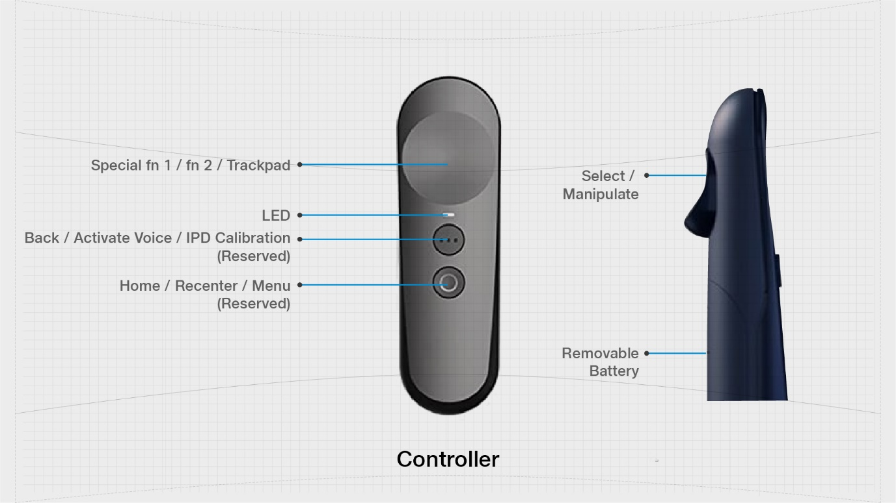

# JioGlass Controller Interactions

### JioGlass Controller

The **JioGlass Controller** is a **3DoF** controller with 4 programmable buttons and a trackpad.


All the Physical and Virtual Controllers have the same functionalities; you can refer to other controllers in the above section.  [Controller Specs](../device-information/controller-specifications/)


| **State/Items**    | Descriptions                                                                                                                                                                                                                           |
| ------------------ | -------------------------------------------------------------------------------------------------------------------------------------------------------------------------------------------------------------------------------------- |
| **Select**         | Single click button for carrying out any app-related interaction​. Maps to ISelectHandler and ISelectClickHandler                                                                                                                      |
| **Manipulate**     | Long press and move controller/gaze to grab and move any grabbable object. Release to drop the grabbed object. ​Maps to IManipulationHandler.                                                                                          |
| **Trackpad**       | 2 Axis gesture-enabled joystick​. Maps to ISwipeHandler and ITouchHandler                                                                                                                                                              |
| **Fn 1**           | Application-specific special button. Can be used for system-wide functions within the application such as toggling head tracking.                                                                                                      |
| **Fn 2**           | Application-specific special button. Can be used for system-wide functions within the application such as toggling head tracking. ​                                                                                                    |
| **Back**           | Single click button to navigate the application one step below in their UX hierarchy. You are expected to implement the IBackHandler Interface and manage the application flow within your application yourself. Maps to IBackHandler. |
| **Activate Voice** | Long press button for enabling voice interactions. **Coming Soon​**                                                                                                                                                                    |
| **Home**           | Single click button that takes the user back to the home screen.**​**                                                                                                                                                                  |
| **Recentre**       | Long press button to the re-center head and controller orientation during an application​.                                                                                                                                             |
| **Menu**           | Double press the button that opens System Menu. **Coming Soon.**                                                                                                                                                                       |
