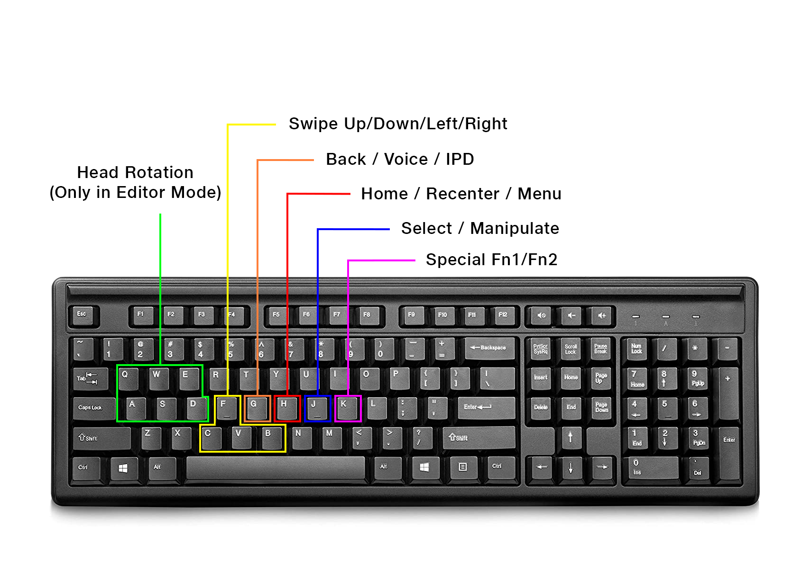

# Editor Emulator

**Debugging** in Editor mode is very crucial for faster app turnaround and efficient development cycles. To that end, the **SDK** offers ways to emulate the experience right in the Editor mode with the keyboard bindings as shown below:

## Changing Editor Emulator Bindings

To change these bindings go to Assets > JMRSDK > Emulator > Data > SO\_Emulator Current and change the bindings in the scriptable object.\
\

<figure><figcaption></figcaption></figure>

<figure><figcaption></figcaption></figure>

