# Tesseract Mixed Reality UI Toolkits


* Toolkit v1 has been deprecated, please upgrade to Toolkit v2 or Toolkit v3 to enjoy the latest features and upgrades
* JMRInputField needs to be updated with the new prefab JMRPrimaryInputField&#x20;


Toolkits or **JMRToolkits** are intended to accelerate the development of Applications targeting **JioGlass**. In this section, we will learn how to use and customize the Toolkits.


**It is recommended to use the JMRKeyboard in your applications that require a virtual keyboard. This helps to bring consistency for the end-user and reduces overall cognitive overload while using different applications with keyboards**


### UI Toolkits

To make the Jio Mixed Reality interface consistent and easy for developers to build upon, we have introduced drag-n-drop UI toolkits that can be easily configured to suit their needs while adhering to their brand guidelines.

* Color System – Allowing developers to customize the colors of the toolkits from the menu bar.
* Icon System – Allowing developers to change icons and text from inspector without disturbing alignment, font, and size on each toolkit
* Toolkits **-**
  * Canvas
  * Button
  * Check Box&#x20;
  * Check Box Group
  * DialogBox
  * Error DialogBox
  * Drop Down
  * Image View
  * Progress bar
  * Radio Button
  * Radio Button Group
  * Horizontal Scroll
  * Vertical Scroll
  * Search Field (With Keyboard integrated)
  * Slider
  * Toggle Button
  * Tooltip
  * Input Field (With Keyboard integrated)
  * VideoPlayer
  * Voice Toolkit

### Using the Toolkits

To add any toolkit to the scene, go to **JioMixedReality -> Toolkits ->** then click on the Toolkit you want. Let’s see the usage of Toolkits with the help of an example.

* To add any **JMR UI Toolkit** to the scene we first need to add the **Canvas** Toolkit. Go to **JioMixedReality -> Toolkits -> Common -> Canvas** to add it to the scene.

.png>)

* Alternatively, you can also create your **Canvas** using **GameObjects -> UI -> Canvas**. Click on **Convert to JMRSDK Canvas**. Change the position to **(0, 0, 5)**. Change the **X**, **Y** and **Z** scale to **0.001**. This scaling step is very important!
* Let’s add the Button Toolkit to the scene. With **Canvas** **selected** go to **JioMixedReality -> Toolkits -> V2 -> Button**. **JMRUIButton** will be added as a child of the **selected GameObject.**

.png>)

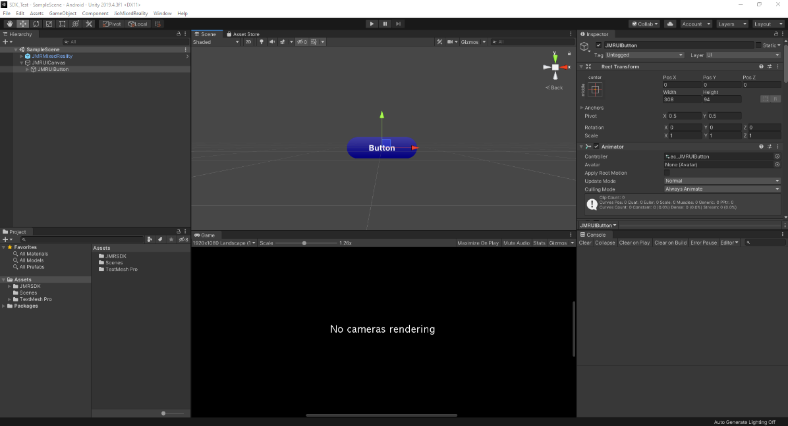

* You can customize the **Button** to have **Text** or **Image** as its **Icon Type**

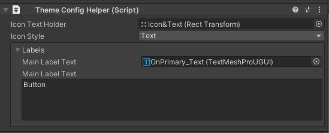

* Go to the **ThemeConfigHelper** script attached to the **Button**. Open the **Icon Style** dropdown and select **Sprite**.

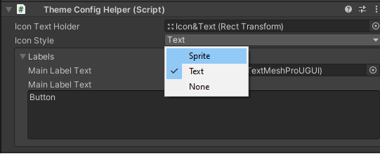

* The section below the dropdown will now change and show you some images. Click on any one of the images and it will be displayed on the **Button**.

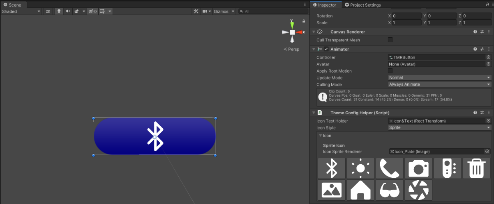

* Open the **Icon Style** dropdown again and select **Text**. In the **Main Label Text** below the dropdown, change the text to **“Click Me”** and the same will be displayed on the Button in the scene.
* To add an event on Button Click you can use the **OnButtonClick** event present on the **JMRUIButton** script on the Button.

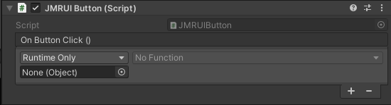

* You can also add listeners to this event from other scripts.

```csharp
public JMRUIButton button;
myButton.onButtonClick.AddListener(MyMethod);
```

Let’s take a look at another example.

* Again, with the **Canvas selected**, go to **JioMixedReality -> Toolkits -> V1 -> Toggle** and click on it. **JMRToggle** will be added as a child of the Canvas.

.png>)

* Just like we changed the **Icon Type** of the **Button** above, we can change the **Icon Type** of **Toggle** using the **JMRThemeConfigHelper** script on it.

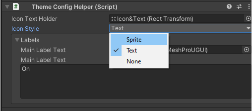

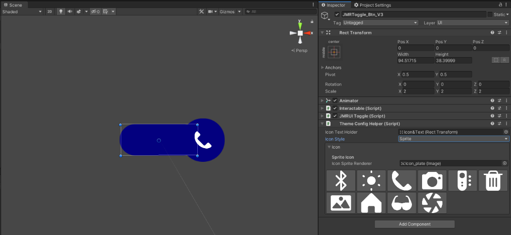

* To add an **action** when the value of the **Toggle** changes, you can use the **OnValueChanged** event present on the **JMRUIToggle** script on the **Toggle**.

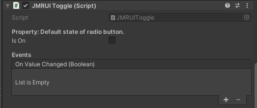

* You can also add **listeners** to this event from other scripts.

```csharp
public JMRUIToggle myToggle;
myToggle.OnValueChanged.AddListener(MyMethod);
```

### Customizing the Toolkits

The colours and icons of all the toolkits can be changed at once using the **Theme Configurator** (TC). To open the TC, go to **JioMixedReality -> Toolkits Configuration** and click on it. In the TC window which opens, you’ll see 2 sections viz. Colours and Icons. Both these sections have some default values. Let’s take a look at each of these sections.

#### Changing Colors of the UI from Toolkit Configuration

You can change the default colours for each layer by clicking on them, in the Toolkit configuration window.

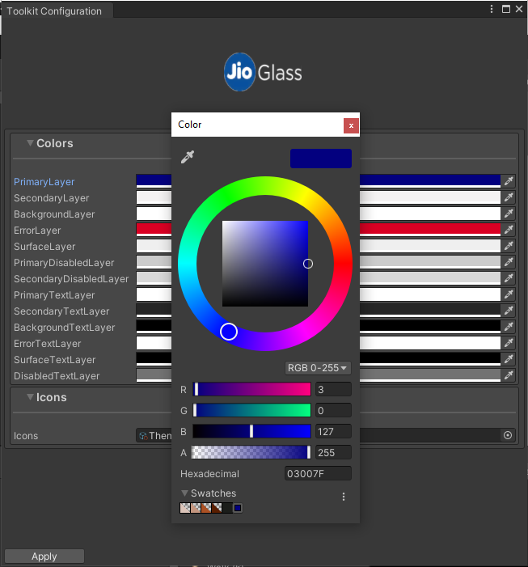

* Let’s change the **Primary Layer** colour to some shade of green.

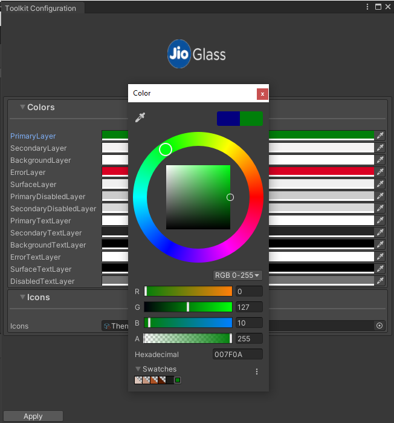

* Click on **Apply** button at the bottom of the window to apply this change to all the Toolkits present in the scene as well as in the entire project.

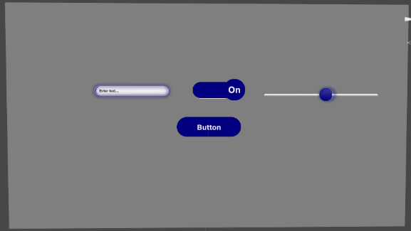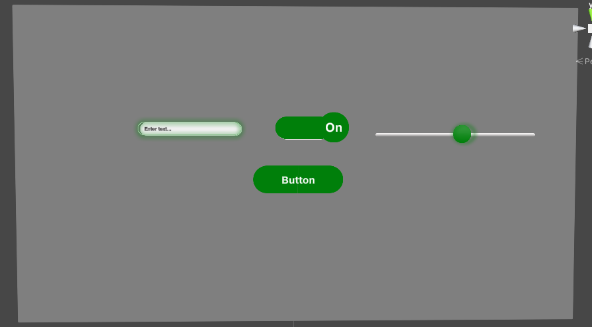

&#x20;                                          _Before and After changing Color_

#### Changing Icons of the UI from Toolkit Configuration

Icons provide visual feedback to the user.

* In the Icon section on the Toolkit Configuration window, you will see there’s a reference of a Scriptable Object named **SO\_ThemeData**. **(Assets\JMRSDK\JMRToolkits\ThemeSystem\ThemeConfiguration\ScriptableObjects\SO\_ThemeData.asset)**

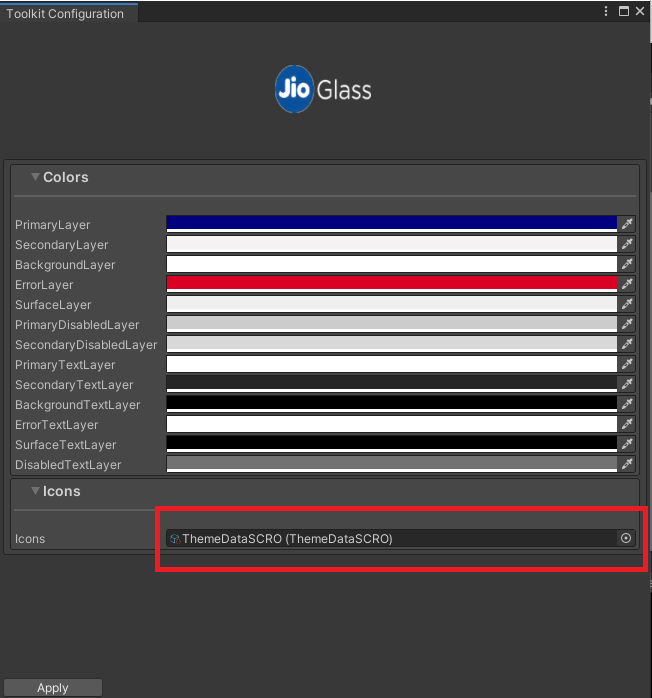

* Open the **Icon Pool** list on **SO\_ThemeData**. These are the Icons which will be shown when you change the Icon type of any toolkit from **Text** to **Sprite**.

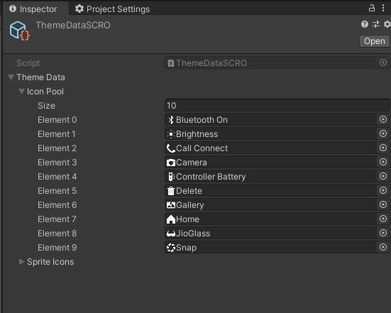

* Let’s change the first sprite with any temporary sprite for testing.

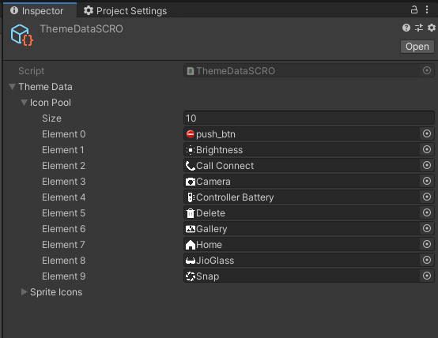

* Now open the **Theme Configurator** window and press **Apply**.
* Now add a **Button** toolkit to the scene and select **Sprite** in the **Icon Type** dropdown on the **JMRThemeConfigHelper** script on it.
* You should see the newly added Icon in the list below.

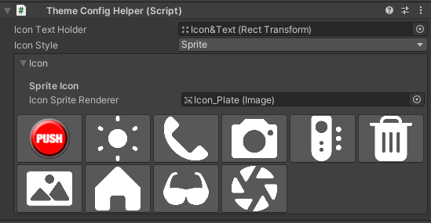

## JMRDragable Component

All existing custom-scrolls, sliders and all other draggable objects should have a JMRDraggable.cs script component on them.

1\.  Select ViewPort of existing CustomScrolls or Sliders.

2\.  Add component “JMRDraggable.cs” on it.

