# Companion App for Jio Mixed Reality (JMR) Devices

### Setting up the Companion App

* Download the latest **JioGlassCompanionApp.apk** build in the format of an android application package (.apk).
* Install this downloaded application on the testing device which you will be using for further debugging.
* Click on the **JioGlass** icon in the app drawer (**jioGlass** app) to open it.

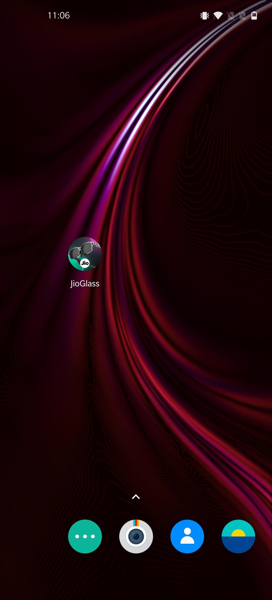

* Allow all the permission requested by the companion app

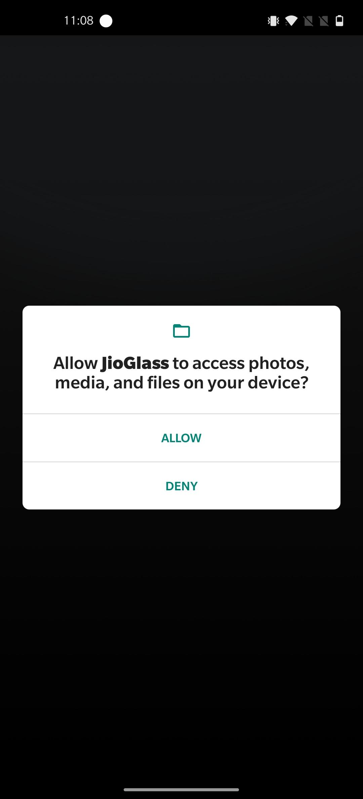

* Allow display over other apps permission and press back

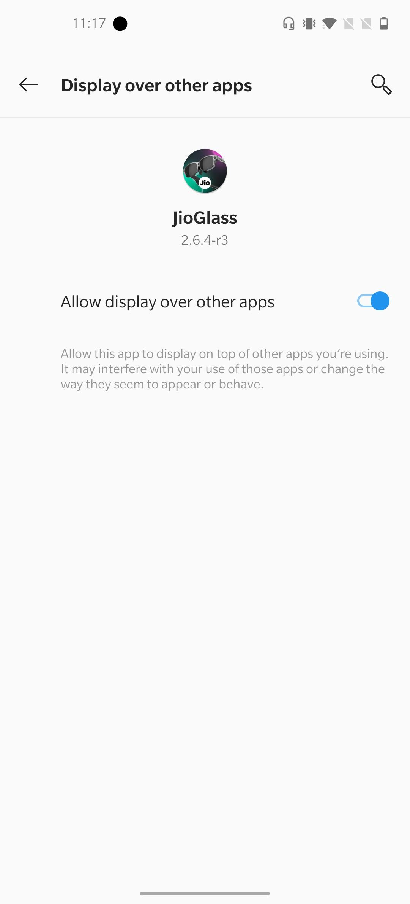

* Enter 'developer@tesseract.in' as email id and the 'JioGlass@123' as a password

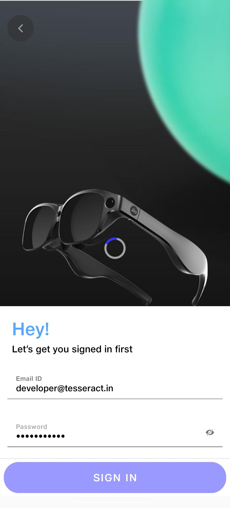

* Create profile or select previously created profile

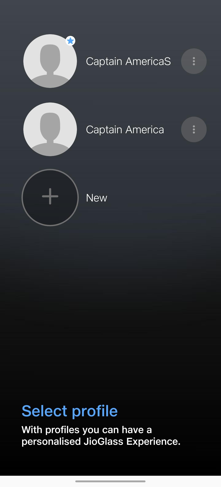

* Tap on top right icons to get status of Jio Glass and Controller

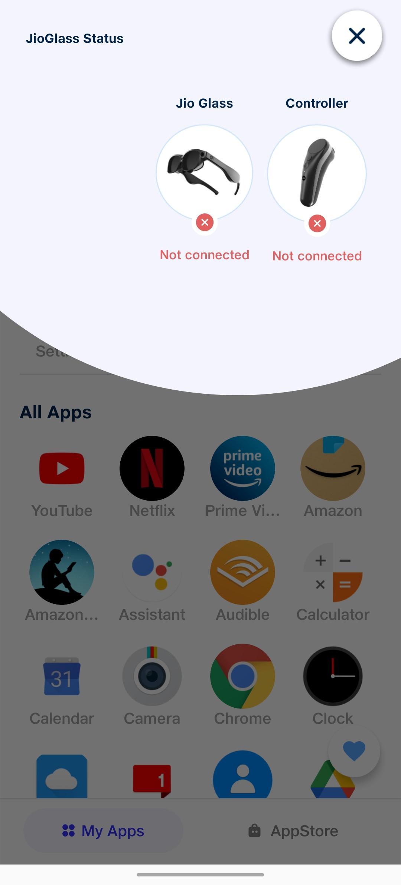

* Tap on JioGlass icon to setup your JioGlass

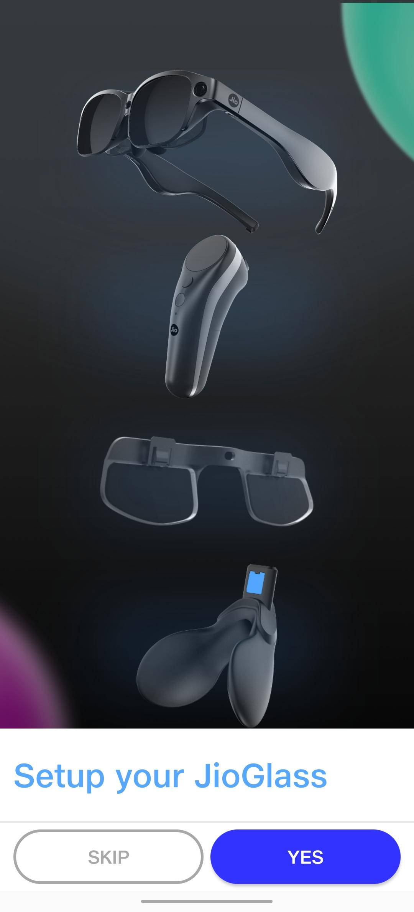

* Once JioGlass is connected, prepare your controller to connect

.png>)

* Prepare your controller to connect&#x20;

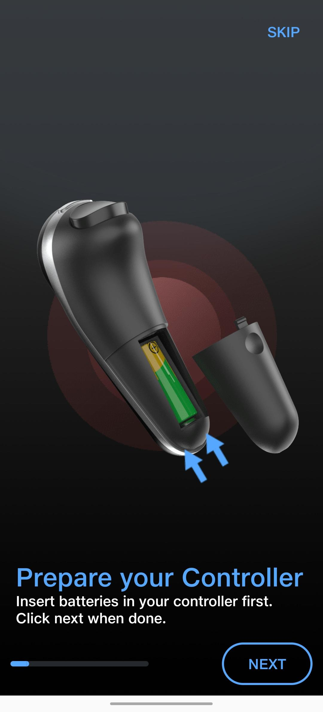

* Switch on Bluetooth

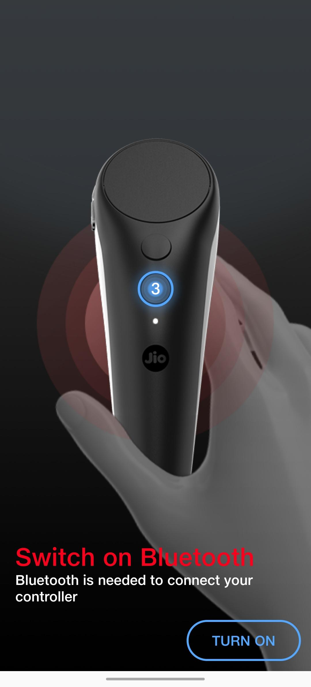

* Press Home button for 3 second to pair your controller with phone.

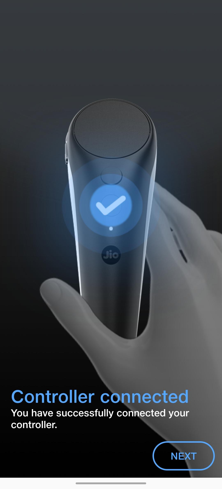

* Status of Jio Glass and Controller can be checked by clicking either icon on top right corner.

.png>)

* Switch to Holoboard open JioGlassDev App

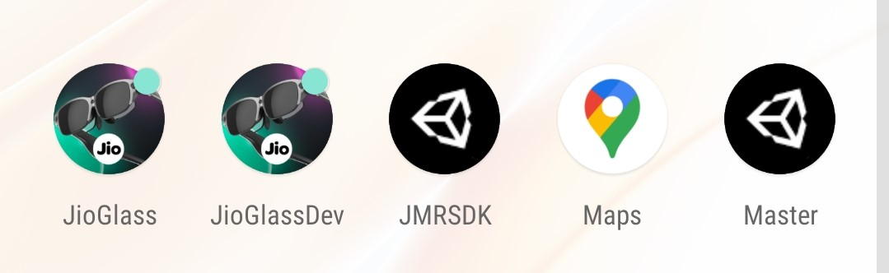

* Select Holoboard to use Holoboard mode

