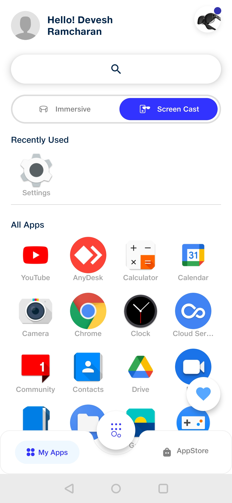

# Companion App for Jio Mixed Reality (JMR) Devices

## Setting up the Companion App

* Download the latest **JioGlassCompanionApp.apk** build in the format of an android application package (.apk).
* Install this downloaded application on the testing device which you will be using for further debugging.

## Switching to Holoboard&#x20;

Open JioGlassDev App

.png>)

Select Holoboard to use Holoboard mode

.png>)

## Setting up JioGlass App

* Click on the **JioGlass** icon in the app drawer (J**ioGlass** app) to open it.
* Allow all the permission requested by the companion app

.png>)

* Allow display over other apps permission and press back

.png>)

* Enter 'developer@tesseract.in' as email id and the 'JioGlass@123' as a password

.png>)

* Create profile or select previously created profile

.png>)

* Tap on Yes as shown below and follow the on-screen instructions to setup your JioGlass App

.png>)

* Once you reach JioGlass Home Screen as shown below, click the button in the centre to start pairing your JioGlass Controller

* Prepare your controller to connect&#x20;

.png>)

* Switch on Bluetooth

.png>)

* Press Home button for 3 second to pair your controller with phone.

.png>)

* You are now setup and ready to use JioGlass
