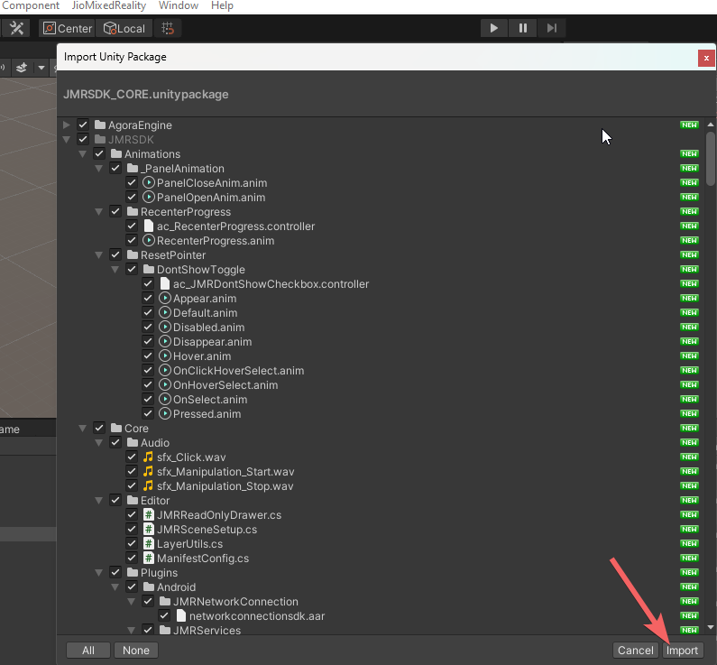
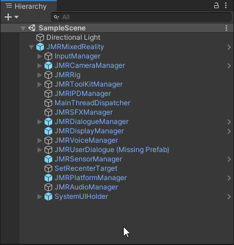
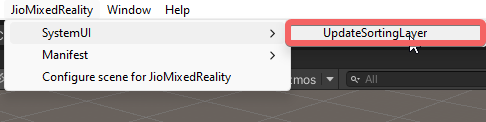

# Setting Up Jio Mixed Reality Project in Unity

This section will help you set up a Project so that you can start developing applications using **JMRSDK**. You will need [Unity Game Engine](development-platform.md#unity3d-versions) and the latest version of the JMRSDK package.&#x20;

### Importing the SDK

* Download any [supported version](development-platform.md#unity3d-versions) of **Unity**. During installation, ensure that Android Build Support is selected as your target platform.
* Open **Unity** and create a new Project.
* Use the latest version of **Jio Mixed Reality SDK** (JMRSDK).
* Navigate to **Assets -> Import-Package -> Custom Package,** as shown below.

* Navigate to the folder where you have stored the SDK package and select the JMRSDK-Core package.
* Once the **Import Unity Package** dialogue opens, select **All** at the bottom and then select **Import**.

<figure><figcaption>
import
</figcaption></figure>

* After the import process, a new folder will be created under **Assets** named **JMRSDK**.

### Setting up your Jio Mixed Reality Scene

If creating a new scene, ensure that no Camera component is present. **Remove the Main Camera (if any) from your scene.**

After you have imported JMRSDK, you will see a new **JioMixedReality** menu on the top menu bar. Click on it and then click on Configure scene for **JioMixedReality,** as shown below.

<figure><figcaption></figcaption></figure>

* You should now see a **JMRMixedReality** object in your scene as shown in the image below.

<figure><figcaption></figcaption></figure>

* Your scene is now ready to be used with **JMRSDK**. To test this, let’s add a cube to the scene.
  1. Go to **GameObject -> 3D Object -> Cube**
  2. Set the position of this **Cube** to **(0, 0, 5)**.

.png>)

* You can now follow the instructions in the **Publishing** section to build your first application for your **Target Device**.
* Once you run the application on **JioGlass**, you will notice the **Cube** floating somewhere around you. (You might have to look around to find it! OR you can **long-press** the **Home Button** to **Recenter** the screen which will bring the **Cube** in front of you). Have a look at the controller interactions to get an idea of how to use the JioGlass controller.

### Setting up System UI configuration


**Mandatory**: Configure System UI in all applications before building your app.


From Menu, select


JioMixedReality > SystemUI > UpdateSortingLayer

<figure><figcaption></figcaption></figure>
