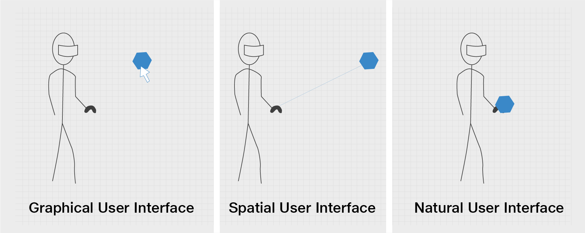
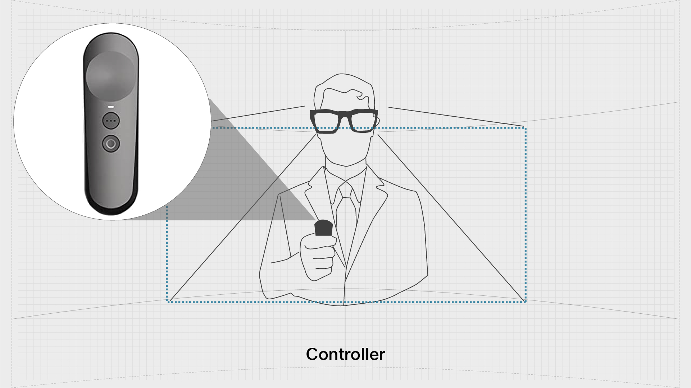

# JioGlass Controller

Controllers are representations of a physical controller. They are created by device managers and are responsible for communicating with the corresponding underlying system and translating that data.

## Paradigms of Controller Based Interaction 

Controller based interactions can be further categorised into three paradigms based on the input mechanism and the physics of focusing on objects and interacting

* **Abstracted**​\
  The abstracted method of interaction is like using a mouse on a traditional 2D Graphical User Interface. Here the motion of the interaction tool (mouse) is in a different coordinate system than the action (mouse pointer)​
* **Ray**​\
  The ray method utilizes the depth information in any Spatial User Interface to projected an extended control emitting from the interaction tool (mouse)​
* **Volumetric**​\
  Volumetric method is the most natural form of interaction since it allows the user to directly manipulate the virtual objects in 3D just as if they were real objects.​

## JioGlass Controller 

Generally, a controller's lifecycle will involve:

1. A controller gets created by a device manager upon detection of a new source (for example, the detects and starts tracking a hand).
2. In the controller's Update() loop, it calls into its underlying API system.
3. In the same update loop, it raises input event changes by calling directly into the core input system itself (for example, raising HandMeshUpdated, or HandJointsUpdated).

## Interactions in Tesseract Mixed Reality​

| **Action**          | Descriptions                                                                                                                                                                                                                           |
| ------------------- | -------------------------------------------------------------------------------------------------------------------------------------------------------------------------------------------------------------------------------------- |
| **Select**          | Single click button for carrying out any app-related interaction​. Maps to ISelectHandler and ISelectClickHandler                                                                                                                      |
| **Manipulate**      | Long press and move controller/gaze to grab and move any grabbable object. Release to drop the grabbed object. ​Maps to IManipulationHandler.                                                                                          |
| **Trackpad**        | 2 Axis gesture-enabled joystick​. Maps to ISwipeHandler and ITouchHandler                                                                                                                                                              |
| **Special Fn 1**    | Application-specific special button. Can be used for system-wide functions within the application such as toggling head tracking.                                                                                                      |
| **Special Fn 2**    | Application-specific special button. Can be used for system-wide functions within the application such as toggling head tracking. ​                                                                                                    |
| **Back**            | Single click button to navigate the application one step below in their UX hierarchy. You are expected to implement the IBackHandler Interface and manage the application flow within your application yourself. Maps to IBackHandler. |
| **Activate Voice**  | Long press button for enabling voice interactions. **Coming Soon​**                                                                                                                                                                    |
| **Home**            | Single click button that takes the user back to the home screen.**​**                                                                                                                                                                  |
| **Recentre**        | Long press button to the re-center head and controller orientation during an application​.                                                                                                                                             |
| **Menu**            | Double press the button that opens System Menu. **Coming Soon.**                                                                                                                                                                       |
| **IPD Calibration** | Double press the button that opens the IPD Calibration screen to update the view to your eyesight so that you don’t see blurred or dual images.                                                                                        |

## Input Actions Key Bindings&#x20;

| **Action Name** | **Button Event**          | **JioGlass Controller Button** |
| --------------- | ------------------------- | ------------------------------ |
| Select          | Single Click              | Trigger                        |
| Manipulate      | Long Press + Swipe/Rotate | Trigger + Pointer              |
| Swipe           | Dual Axis                 | Touchpad                       |
| Touch           | Dual Axis                 | Touchpad                       |
| Special Fn1     | Single Click              | Touchpad                       |
| Special Fn2     | Double Click              | Touchpad                       |
| Back            | Single Click              | App Button                     |
| Voice Trigger   | Long Press                | App Button                     |
| Home            | Single Click              | Home Button                    |
| Recenter        | Long Press                | Home Button                    |
| Menu            | Double Click              | Home Button                    |
| IPD Calibration | Double Click + Swipe      | App Button + Touchpad          |
