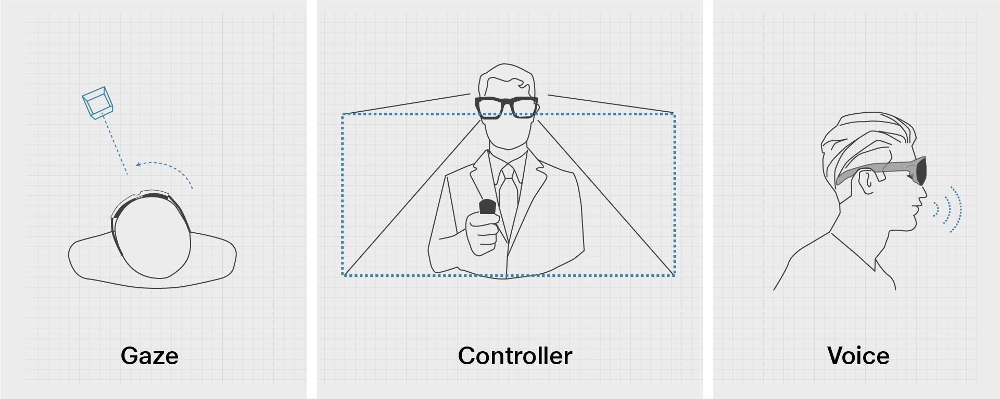

# Multimodal Interactions

According to various studies, ‘**Multi-Modal Interactions**’ are necessary to make the experience more immersive. Multi-Modal means the involvement of various sensory inputs, like sound, visual, haptic feedback (your controller vibrates), etc.

## **JioGlass Controller**

Motion controllers allow users to take action in mixed reality. An advantage of motion controllers over [gestures](https://docs.microsoft.com/en-us/windows/mixed-reality/design/gaze-and-commit#composite-gestures) is that the controllers have a precise position in space, allowing for fine grained interaction with digital objects. Jio uses controllers as the primary mode of interaction in Mixed Reality

## Gaze 

_Head-gaze and commit_ is a special case of the [gaze and commit](https://docs.microsoft.com/en-us/windows/mixed-reality/design/gaze-and-commit) input model that involves targeting an object with the direction of your head pointing forward (head-direction), and then acting on it with a secondary input, such as the hand gesture air tap or the voice command "Select".

### Target sizing and feedback 

The head gaze vector has been shown repeatedly to be usable for fine targeting, but often works best for gross targeting--acquiring somewhat larger targets. Minimum target sizes of 1 to 1.5 degrees allow successful user actions in most scenarios, though targets of 3 degrees often allow for greater speed. Note that the size that the user targets is effectively a 2D area even for 3D elements--whichever projection is facing them should be the targetable area. Providing some salient cue that an element is "active" (that the user is targeting it) is extremely helpful. This can include treatments like visible "hover" effects, audio highlights or clicks, or clear alignment of a cursor with an element.

Voice is one of the key forms of input on HoloLens. It allows you to directly command a hologram without having to use [hand gestures](https://docs.microsoft.com/en-us/windows/mixed-reality/design/gaze-and-commit#composite-gestures). Voice input can be a natural way to communicate your intent. Voice is especially good at traversing complex interfaces, because it lets users cut through nested menus with one command.

Voice input is powered by the [same engine](https://msdn.microsoft.com/library/windows/apps/mt185615.aspx) that supports speech in all other _Universal Windows Apps_. On HoloLens, speech recognition will always function in the Windows display language configured in Settings.

### Voice and gaze 

When using voice commands, (head or eye) gaze is typically used as the targeting mechanism, whether with a cursor ("select") or to implicitly channel your command to an application that you are looking at. For this, it may not even be required to show any gaze cursor _("see it, say it")_. Of course, some voice commands don't require a target at all, such as "go to start" or "Hey Cortana."

## Usage 

### **Pros**​

* _**Reduces**_ _**time**_ _**and**_ _**effort-**_ Imagine just telling the computer what to do instead of having to do tasks manually. Hella time-saving.​
* _**Socially**_ _**acceptable-**_ People around us all talk on their smartphones, so it is not something that would be seen as weird. (Unless of course, you do it in a public setting with a high tone).​
* _**Routine-**_ Done well, this form of interaction can become routine quickly, as it is intuitive and feels natural.​

### **Cons**​

* _**Accent-**_ What if the MR does not understand your accent? If it does understand, what about the context?​
* _**Quantify-**_ Supposedly you tell the MR computer to reduce the volume, or increase it, what is it supposed to do? How much louder do you want it? Think about checking your e-mail and you say “zoom in”; well, how much?​

## **Jio's Voice Interaction Guidelines**​

### **Dos**​

* Concise commands​
* Simple Vocabulary​
* Consistency​

### **Don’ts**​

* Single syllable commands​
* System commands​
* Similar sounds​
