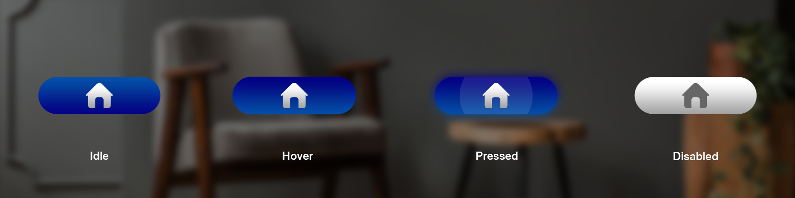

# States

States are visual representations used to communicate the status of a component or interactive element.

## Button States 

A button is completely defined by 4 states as described below -

| **State**        | Description                                                                                                                                                                             |
| ---------------- | --------------------------------------------------------------------------------------------------------------------------------------------------------------------------------------- |
| **Default/Idle** | Default state of the UI element.                                                                                                                                                        |
| **Hover**        | 
State of the UI element when the button is in focus.

A slight glow will appear on the UI element when the user gazes at the UI element​ to indicate user
                   |
| **Pressed**      | 
State of the UI element when it is being interacted with.

A hard glow appear on the UI element when the user interacts with the button by pressing a button​
               |
| **Disabled**     | 
State of the UI element when that UI element is non-interactable.

A faded UI will be shown indicating that the UI is currently disabled means not active for interaction.​
 |

## Layout 

