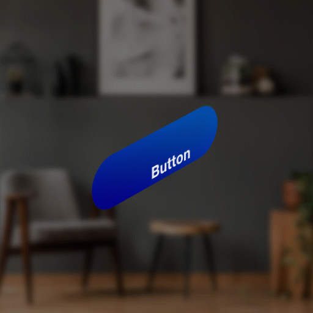
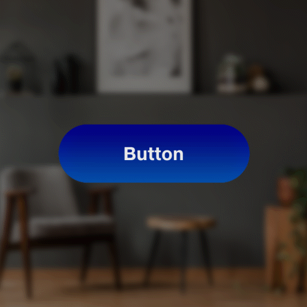
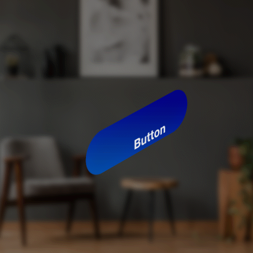
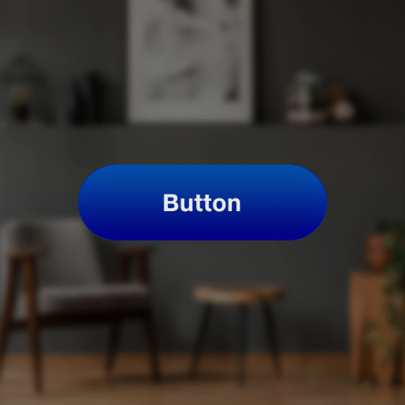

# Transitions

Transitions gives intelligent feedback based on the user's behaviour, keeps the UI feeling alive, and guides the user's navigation through your app. Motion elicits an emotional connection between a user and their digital experience. We build on a foundation of natural movement the user already understands from the physical world, and we extend our system from there.

## Content 

The buttons can transition between the 4 state via the animations as described below -

| **Transition States** | **Descriptions**                                                     |
| --------------------- | -------------------------------------------------------------------- |
| Appear                | Animation for showing the UI elements for the first time they appear |
| Enter                 | Animation when the user looks on a UI element                        |
| Exit                  | Animation when the user looks away from an UI element                |
| Interact              | Animation when the user interacts with the UI element                |
| Disappear             | Animation for when the UI elements disappear from the scene          |

## Transitions Example 

| **Transitions** | **Front View**                          | **Isometric View**                      |
| --------------- | --------------------------------------- | --------------------------------------- |
| **Appear**      |  |  |
| **Enter**       |  |  |
| **Exit**        |  |  |
| **Interact**    |  |  |
| **Disappear**   |  |  |
