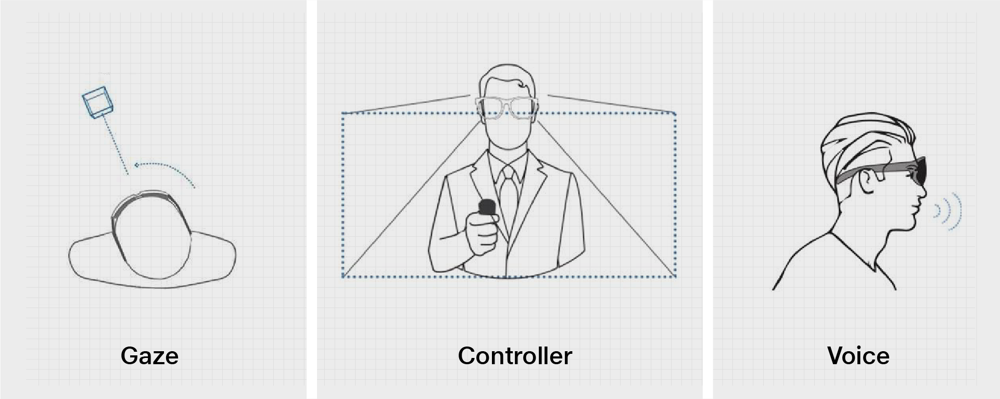

# Introduction - Interaction Design

Jio’s Mixed Reality Interaction design follows a multi-modal approach wherein a combination of different interaction paradigms come together to form a more natural system of interactions. Jio Mixed Reality system uses a combination of three distinct interaction elements as described in below

## **Gaze**​

Gaze is the primary interface used for selecting and highlighting icons and holograms​

## **Controller**​

Controller is the primary interface used for interacting with the selected icons or holograms​

## **Voice**​

Voice is the secondary interface used for interacting with the selected icons or holograms
