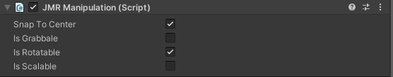

# Manipulation

### Direct Manipulation of 3D GameObjects

1. Add a **Cube**, a **Sphere,** and a **Capsule** to a **JMRSDK** configured scene and position them as shown in the image below.
2. Attach **JMRManipulation** script to these 3 objects.
3. On the **JMRManipulation** script on each of these objects, select the options as shown belo&#x77;**:**

* **Cube**: **IsRotatable**
* **Sphere**: **IsGrabable**, **IsScalable**
* **Capsule**: **IsGrabable**, **IsMovable**

.png>)

* Now play the scene and point the ray on the **Sphere**. Start the **Manipulation** action by long-pressing the **Trigger** button.
* The **Sphere** will snap to the pointer. Now you can **Scale** the **Sphere** by swiping the trackpad.
* Repeat the same process with **Cube** and it will **Rotate** when you swipe on the trackpad.
* Repeat the same process with **Capsule** and you will be able to **Move** the **Capsule** around the scene.
* **SnapToCenter** option on **JMRManipulation** script is an experimental feature. Selecting this option will snap the pointer ray to the **Center** of that object.


It is recommended to use JMRManipulation2 over JMRManipulation as it is feature-rich with better stability.

