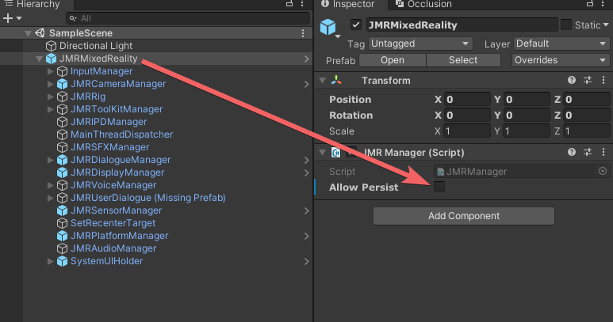

# JMRMixedReality Prefab

JMRMixedReality is the prefab instantiated when you configure a scene for Mixed Reality. This prefab consists of all the systems required for communication with the hardware, rendering, input, and handling system UI popups.

### Allow Persist


When allow persist is enabled, JMRMixedReality Gameobject persists, i.e., when the scene is changed, the new JMRMixedReality Gameobject in the loaded scene is replaced with the persistent JMRMixedReality Gameobject.


#### Persistent Rig - Allow Persist enabled

When allow persist is enabled, JMRMixedReality Gameobject is moved to _Don't Destroy On Load_ scene.&#x20;

When the scene is switched, the existing allow persistent JMRMixedReality Gameobject destroys the loaded scene's JMRMixedReality GameObject.

#### Non - Persistent Rig - Allow Persist disabled

In Non-Persistent, the JMRMixedReality Prefab will persist only in the current scene. In the next scene, a new JMRMixedReality Prefab should be present for handling all JMRSDK systems.

<figure><figcaption>
Allow Persist
</figcaption></figure>

