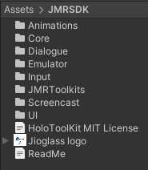

# JMRSDK Content

Package Content

### JMRSDK Modules / Sub-Systems

### Agora Engine&#x20;

<figure><figcaption></figcaption></figure>

### Clever Tap Unity

<figure><figcaption></figcaption></figure>

### Prefabs

<figure><figcaption>
JMRSDK Prefabs
</figcaption></figure>

### Plugins

<figure><figcaption></figcaption></figure>

<figure><figcaption></figcaption></figure>

