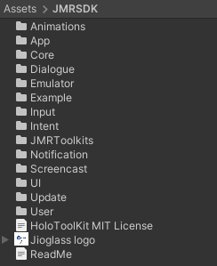

# JMRSDK Content

## Package Content

### JMRSDK Modules / Sub-Systems

### Agora Engine&#x20;

<figure><figcaption>
Agora Engine
</figcaption></figure>

### Prefabs

<figure><figcaption>
JMRSDK Prefabs
</figcaption></figure>

