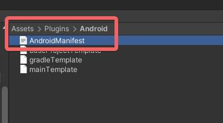

# Upgrade Guide 4.33.13

* Upgrade Unity to 2021.3.x LTS
* To interact with Gaze and click on editor press \[j] on the keyboard
* To enable and disable the dock, developers can use `JMRSystemDockManager.Instance.ToggleDockVisiblity(bool)` function
* To enable and disable interaction, developers can use `JMRPointerManager.Instance.ToggleInteraction(bool, JMRPointerManager.PointingSource.Head)`

## Adding app visibility in the Android launcher

1. Open Android Manifest file.

<div align="left"><figure><figcaption><p>Android Manifest</p></figcaption></figure></div>

2. Uncomment Launcher Intent Filter.\
   \<category android:name="android.intent.category.LAUNCHER" />

<div align="left"><figure><figcaption><p>launcher intent filter</p></figcaption></figure></div>

## <mark style="color:yellow;">Analytics</mark>


<mark style="color:yellow;">This is a compulsory step to add the analytics manager to each of your scenes or as \`Dont destroy on load\`</mark>


#### Adding Analytics Manager as Don't Destroy On Load.

1. Create a C# script named `JMRAnalyticsDontDestroyOnLoad` as shown below.

```
using UnityEngine;

public class JMRAnalyticsDontDestroyOnLoad : MonoBehaviour
{
    void Start()
    {
        transform.parent = null;
        DontDestroyOnLoad(gameObject);
    }
}
```

2. In the first scene of your application, create an empty gameobject and add JMRAnalyticsManager and `JMRAnalyticsDontDestroyOnLoad` script on the same gameobject.

<figure><figcaption><p>First Scene of the project needs to have this.</p></figcaption></figure>


Alternate Method: JMRAnalyticsManager can also be added to any game object in each scene of the project.


3. Add JMRSDK.JMRAnalyticsManager in Project Settings > Script Execution Order and setting its order to less than the default time ( < 0 )

<figure><figcaption><p>Adding JMRAnalytics Manager to -50 in Script execution order</p></figcaption></figure>

### Gaze


Important notice for users upgrading to JMRSDK 4.30.0+ from any previous versions

JMRGazeAndDwellInteraction script has been renamed to JMRGazeInteraction as it now functions with gaze and dwell with gaze and click as well.

Therefore all applications using gaze and dwell before JMRSDK 4.30 will get a missing component error in unity and will have to replace the JMRGazeAndDwellInteraction component with JMRGazeInteraction.


### Toolkit


Important notice for users upgrading to JMRSDK 4.12.4+ from any previous versions

* JMRInputField needs to be updated with the new prefab
* Toolkit v1 has been deprecated from JMRSDK 4.12.4, please upgrade to Toolkit v2 to enjoy the latest features and upgrades

