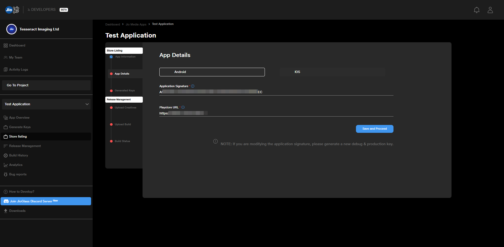

# Licensing Journey In JioImmerse

## Overview

To create a licensed application, the following steps have to be performed.

1. Get the application ready in unity.
2. Create a Google Play Console account, if you don't have one already.
3. Create an application in the Google Play Console.
4. Get SHA1 App Signing Certificate from the application in Google Play Console.
5. Create a project in JioImmerse Developer Console.
6. Create an application in JioImmerse Developer Console.
7. Enter the SHA1 key in the JioImmerse Developer Console.
8. Copy the debug / production key from Dev Console and enter it in Editor > Configure License Key popup.
9. Your application is now licensed.

## Getting the SHA1 key from Play Console

1. Goto your application in Play Console
2. Goto Setup > App integrity > App signing
3. Copy the SHA-1 certificate fingerprint to be entered into Developer Console.

<figure><figcaption></figcaption></figure>

## Setting up licensing in Developer Console

Upload your application SHA1 key from the Play Store and play store URL on the Dev Console.

<figure><figcaption></figcaption></figure>

Get the licensing key to upload in Unity. You have to select between Debug key and Production key.


Debug Key - Debug key can be used to test your application and for internal testing

Production Key - This key has to be used for licensing the application to link it with JioImmerse and be available for users.


<figure><figcaption>
Generating licensing key
</figcaption></figure>

## Setting up licensing in Unity Editor

To build a licensed application compatible with JioImmerse:

1. Goto JioMixedReality > Manifest > Configure License Key and enter the debug / production key from Developer Console
2. Enter the key in the popup in the Unity editor and hit save.
3. The application is now licensed. Build the application. &#x20;

<figure><figcaption></figcaption></figure>

