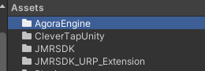
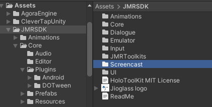
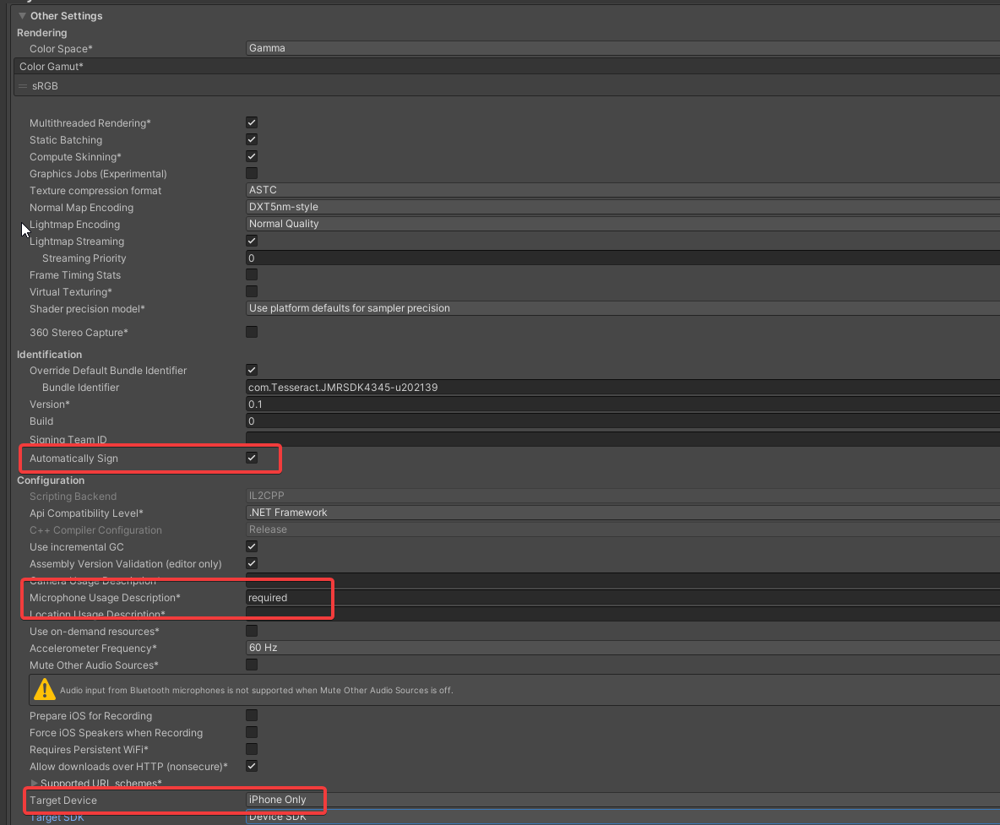
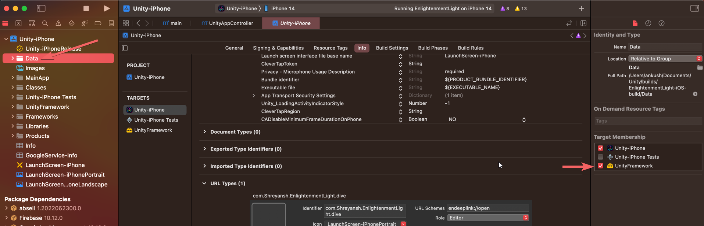
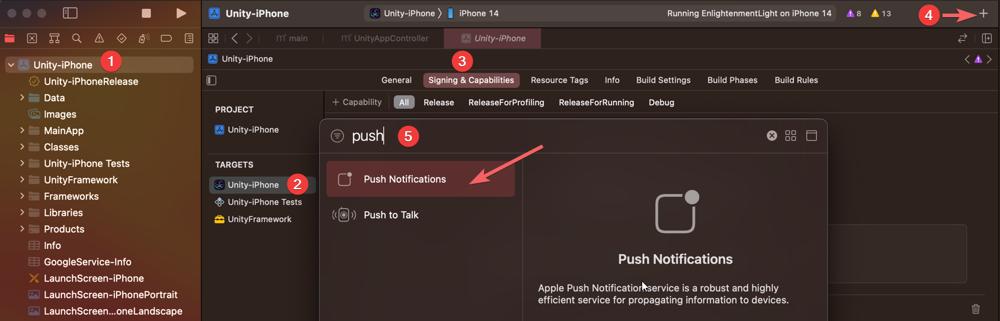
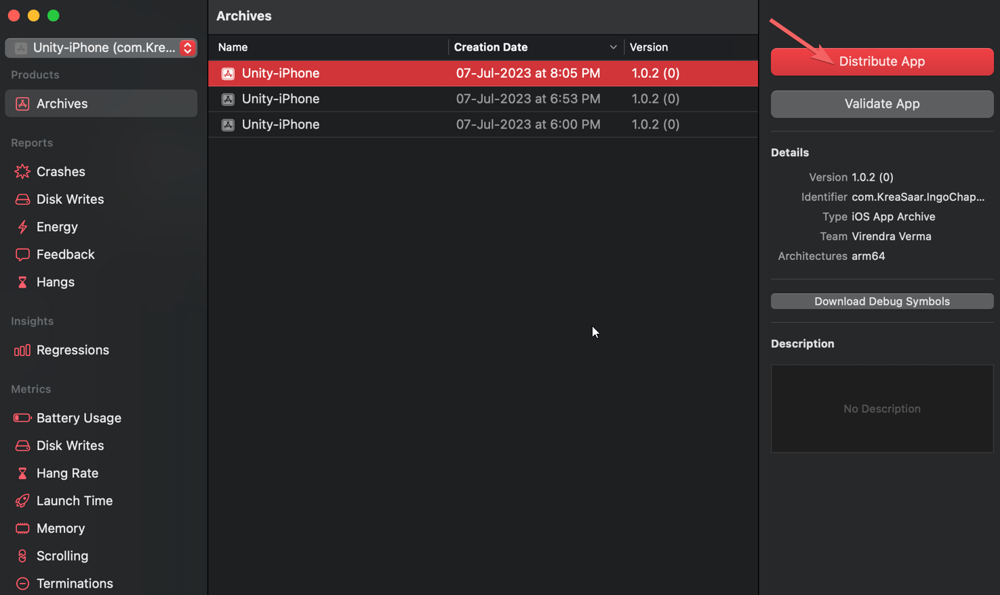

# Publishing to Apple Store

Assuming that you have created your Apple developer account. If not, then check from [here](https://www.youtube.com/watch?v=dkdsjA4KR0g\&ab_channel=AppyPie).

## Configuring Unity&#x20;

<mark style="color:red;">Delete</mark> the Agora Folder.

<mark style="color:red;">Delete</mark> the screencast folder from the JMRSDK.

Goto Unity > Build Settings > Set the orientation to Auto Rotation.\
**Select Landscape Right and Portrait**&#x20;

<figure><figcaption></figcaption></figure>

In Build settings > Other settings > Identification > Enable Automatically Sign

Set the Target device to "iPhone only"

<figure><figcaption></figcaption></figure>

Build the project for iOS in Unity Build Settings

***

## XCode

Open the project in the XCode.

<figure><figcaption></figcaption></figure>

Select the data folder under the project tab, there you will get multiple checkboxes for target membership. Select Unity-iPhone and UnityFramework

<figure><figcaption></figcaption></figure>

### Unity-iPhone&#x20;

Select Unity-iPhone, there you will get the Build Settings, and set the "Enable Bitcode" to no.

<figure><figcaption></figcaption></figure>

Add push notification from the signing and bundle, while selecting the Unity-iPhone.

<figure><figcaption></figcaption></figure>

Select the team signing from the signing and bundle, after selecting the "All" tab.

<figure><figcaption></figcaption></figure>

## Licensing your iOS Application to work with JioImmerse


[licensing-journey-in-ios-jioimmerse.md](../building-and-testing/licensing-journey-in-ios-jioimmerse.md)


## Building and publishing the app

Create a build from Product > Build or use the Command + 'B' shortcut.

<figure><figcaption></figcaption></figure>

If the build fails, refer to FAQs


[faqs-ios.md](../troubleshooting/faqs-building-to-device/faqs-ios.md)


Create an Archive after your build is created from Product > Archive&#x20;

<figure><figcaption></figcaption></figure>

Then go to Window > Organizer, select your build and choose Distribute App

<figure><figcaption></figcaption></figure>


If your build fails in distribution, you will receive a mail with the reason for failure.


***

## Deep linking


Now You must perform [deep linking](ios-deep-linking.md) before proceeding with the build.



[ios-deep-linking.md](ios-deep-linking.md)


***

## App Store Connect

Goto [App Store Connect](https://appstoreconnect.apple.com/). Select My Apps.

Refer to [https://developer.apple.com/app-store-connect/](https://developer.apple.com/app-store-connect/) for publishing your application in iOS App Store.

***

### How to generate IPA file?

Once your archive is generated.

1. Select App Store Connect.&#x20;

<figure><figcaption></figcaption></figure>

2. Select Export

<figure><figcaption></figcaption></figure>

Proceed to generate the IPA file.
