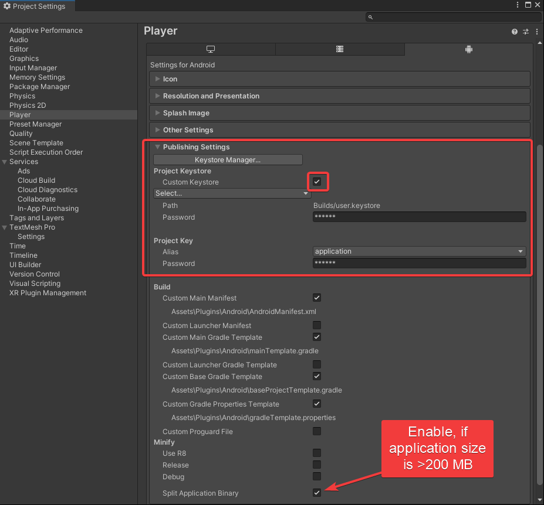

# Publishing to Google Play Store

Player Settings for Publishing to Play Store

* Set Minimum Api level to API level 28 for Android 9.0 Pie
* Target API level to API level 34 for Android 14
* The scripting level backend has to be set to IL2CPP with ARM64 supported.


You might need to upgrade your Target API level to API level 34.


<figure><figcaption></figcaption></figure>

For build errors, refer:


[faqs-building-to-device](../../troubleshooting/faqs-building-to-device/)



[faqs-develop.md](../../troubleshooting/faqs-develop.md)



Add a custom keystore and not publish with a debug key.

Keep your keystore safe as it will be required to create new updates in the Play Store and Developer Console.


If your application size is more than 200 MB, check the split application binary checkbox, as shown in the image.

<figure><figcaption></figcaption></figure>

## Build Settings for Publishing to Play Store

Select Build App Bundle (Google Play) as the play store does not allow publishing of apk.

<figure><figcaption></figcaption></figure>

## Note for Publishing on Play Store with JMRSDK


In the Play Console, it has to be mentioned that the application will not work without the JioImmerse application, as it will cause issues with their testing process.


Mention app access for Google App Review:

Goto App content > App Access > Manage

<figure><figcaption></figcaption></figure>

Select All or some functionality in my app is restricted.

Add an instruction to open the app from JioImmerse.

_Sample for JioDive apps:_

> **Instruction name**: JioImmerse Required
>
> **Any other information required to access your app:** \
> After installing this application, install JioImmerse app and login into it, open JioDive mode. Goto Home in JioImmerse. Select this app. For best experience use a VR cardboard device like JioDive.

<figure><figcaption></figcaption></figure>

## Sharing the testing link

Goto your testing track > Testers > Copy link and share.


The application must be on closed beta or internal testing with developertesseract@gmail.com as a tester.

On Tesseract's approval, the application shall further be asked to shift to a different track.


<figure><figcaption></figcaption></figure>
