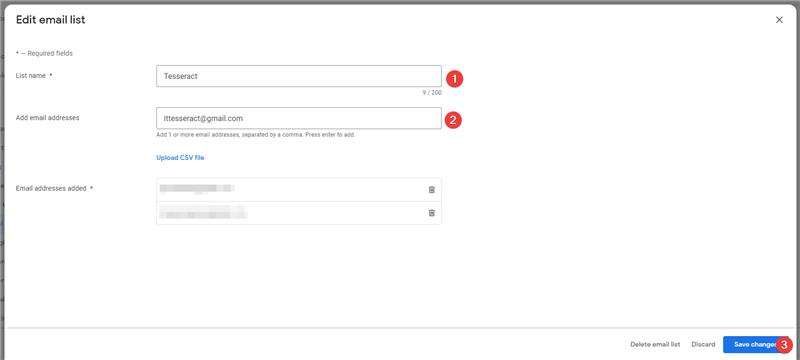
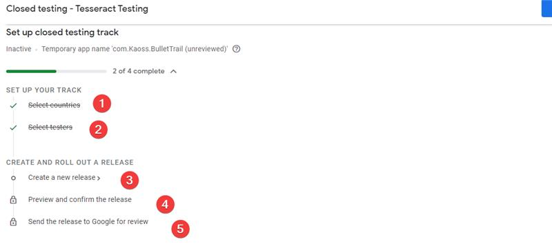

# Play Store Upload Journey

### Overview

This documentation provides a step-by-step guide on how to upload an application in AAB (Android App Bundle) format to the Google Play Store. As of now, AAB files are the recommended format for app distribution on the Play Store. By following this guide, developers can successfully publish their applications and make them available to millions of Android users worldwide.

### Prerequisites

Before starting the upload journey, ensure that you have the following prerequisites:

1. A Google Developer Account: You need to have a Google account and enroll in the Google Play Developer Console. Visit the [Google Play Developer Console](https://play.google.com/apps/publish/) and follow the instructions to create your developer account.
2. Application Assets and Information: Gather all the necessary assets and information required for your application, such as app icons, screenshots, descriptions, and promotional materials.
3. JioImmerse Application: Note that the application being uploaded is dependent on the JioImmerse application for proper testing. The JioImmerse application must be installed on the test device to avoid any issues during the testing process.

### Step 1: Sign in to Google Play Developer Console

1. Visit the [Google Play Developer Console](https://play.google.com/apps/publish/) website and sign in with your Google Developer Account credentials.
2. If this is your first time accessing the console, you may need to agree to the terms and conditions and pay the one-time developer registration fee.

### Step 2: Create a New Application

1. On the Play Console dashboard, click on the "Create Application" button.
2. Enter the default language for your application and provide a title for your app.
3. Click on the "Create" button to create a new application entry.

### Step 3: Fill in the Application Details

1. In the application dashboard, you'll find several sections to fill in the details of your application. These include:
   * **Store Listing**: Provide information such as the application's title, short and full description, screenshots, app icon, category, content rating, and contact email.
   * **Pricing & Distribution**: Set your application to free, select countries where it will be available, and configure other distribution options.
   * **Content Rating**: Answer a series of questions to determine the appropriate content rating for your application.
   * **Release Management**: Configure release channels, manage versions, and set up staged rollouts.
   * **App Content**: Provide additional content details such as application type, genre, and target audience.
   * **Privacy Policy**: If your application collects user data, you'll need to provide a privacy policy URL.
2. Fill in all the required fields in each section, and provide accurate and relevant information.
3. Save the changes after completing each section.


In the play store, it has to be mentioned that the application will not work without the JioImmerse application, as it will cause issues with the testing process of the play store.


### Step 4: Upload Android App Bundle (AAB) File

1. In the application dashboard, navigate to the "App releases" section.
2. Click on the "Manage" button in the "Production track" section.
3. On the "Manage Production" page, click on the "Create Release" button.
4. Choose the release type: either "Internal test," "Closed test," "Open test," or "Production."


The application has to be on closed beta testing with developertesseract@gmail.com as a tester.

On Tesseract's approval, the application shall further be asked to shift to a different track.


5. Select the "Android App Bundle" option for the release format.
6. Follow the on-screen instructions to upload your AAB file.
7. Provide release notes for the new version (if applicable) and select a rollout method (immediate or staged rollout).
8. Save the changes and proceed to review your release.

<figure><figcaption>
Creating a closed testing track
</figcaption></figure>

<figure><figcaption>
Adding internal testers
</figcaption></figure>

<figure><figcaption>
Journey for closed testing track
</figcaption></figure>

### Step 5: Review and Publish

1. After uploading the AAB file, you'll be taken to the release management page.
2. Review all the details, including the release notes, supported devices, and content rating.
3. Click on the "Review" button to submit your application for review by the Google Play Store team.
4. Wait for the review process to complete. This process may take several hours to several days, depending on the workload and complexity of your application.
5. Once your application is approved, you'll receive an email notification. You can also check the status of your application in the Play Console.
6. Note: During the testing process by the Play Store team, ensure that the JioImmerse application is installed on the test device to avoid any issues.
7. Congratulations! Your application is now published on the Google Play Store and available for users to download and install.

### Conclusion

This documentation provided a comprehensive guide on uploading an Android App Bundle (AAB) to the Google Play Store. By following the outlined steps, developers can successfully publish their applications and reach a vast audience of Android users. Remember to maintain the application's quality, provide regular updates, and promptly address user feedback to ensure a positive experience for your users.


