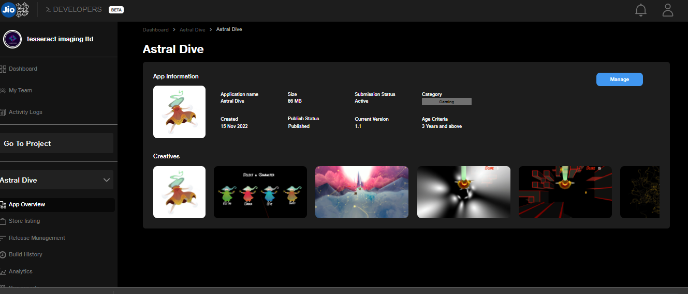
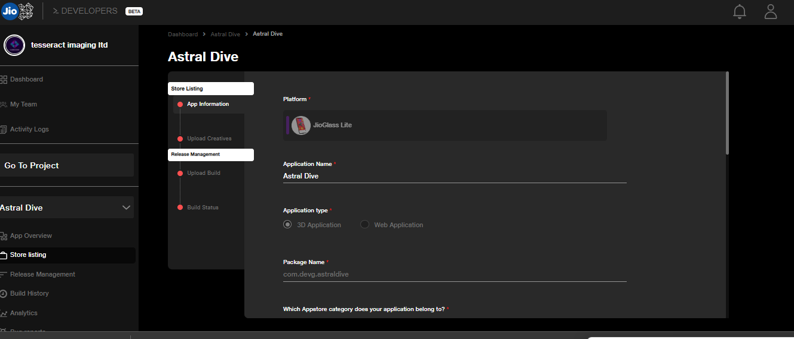
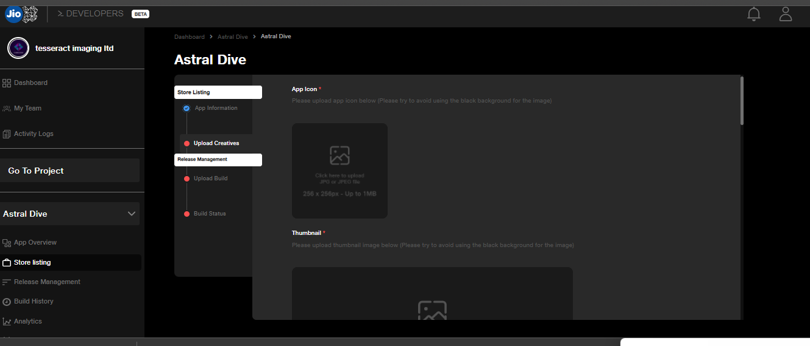
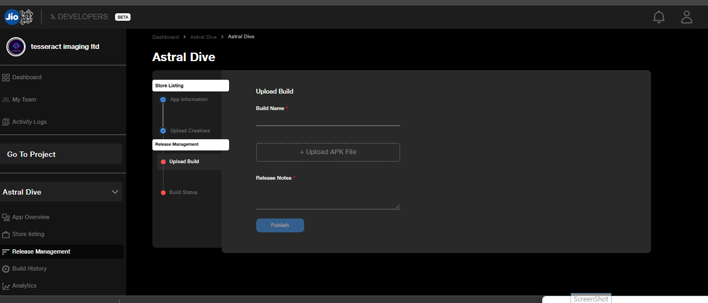

# Publishing to JioGlass Developer Console

This section will look at the steps to publish your application on the **JioGlass Developer** **Console** for **JioGlass Lite, Jio Dive, and Jio Prism.**


Suppose you are updating an existing application on the JioGlass Developer Console. In that case, you can skip the below steps and follow the usual process to update your application as mentioned in updating the App section.&#x20;


### How to Setup an Account on Developer Console and Upload your App

* Please Refer to the [Developer Console Guide](https://tesseractpvt-my.sharepoint.com/personal/developer_tesseract_in/_layouts/15/onedrive.aspx?id=%2Fpersonal%2Fdeveloper%5Ftesseract%5Fin%2FDocuments%2FJioGlass%20Dev%20Console%20Beta%20User%20Guide%2FJioGlass%20Developer%20Console%20%2D%20Documentation%2Epdf\&parent=%2Fpersonal%2Fdeveloper%5Ftesseract%5Fin%2FDocuments%2FJioGlass%20Dev%20Console%20Beta%20User%20Guide\&originalPath=aHR0cHM6Ly90ZXNzZXJhY3RwdnQtbXkuc2hhcmVwb2ludC5jb20vOmI6L2cvcGVyc29uYWwvZGV2ZWxvcGVyX3Rlc3NlcmFjdF9pbi9FZGdxZV81ekFmeEdyV2sybVA3clg5Y0I3V0FJSF9OY3lhaEp2YWh3Y1FWbnlRP3J0aW1lPTBMdEttNC1CMlVn) for JioGlass Lite.&#x20;
* For Jio Prism and Jio Dive, you must only follow Similar Steps but select a Different Platform while creating the App.

<figure><figcaption>
Create New App
</figcaption></figure>

* Select the Platform and fill in all the details
  1. Platform: Select the Platform you are uploading an App For - **Jio Glass Lite, Jio Prism, and JioDive.**
  2. App Name: Name of the Application.&#x20;
  3. Application type: 3D application or web application.
  4. Package Name: The package name of the application that you have built the application with in Unity.

<figure><figcaption>
Go to Project Settings >> Player >> In Identification >> Package Name
</figcaption></figure>


For supporting different platforms, you need to make sure that all the platform builds have separate package names.


> Here is an **example** of how you can have different package names for different devices\
> For JioGlass Lite - com.companyname.appname.Lite \
> For JioPrism - com.companyname.appname.Prism\
> For JioDive - com.companyname.appname.Dive


If you have already created an app on the console, you cannot change its package name. \
Make sure to keep the package names of other platforms different than the existing ones.

You do not need to create a new application if you have already created an application for some device.


<figure><figcaption></figcaption></figure>

* Store Listing: Fill in the store listing details (App Information, Upload Creatives, Upload Build)
* App Creatives  - Please Upload the App Logo, Thumbnails, and Banners as mentioned in the "Add Creative". Go to Manage >> Upload Creatives. \
  &#x20;

<figure><figcaption>
Go to Manage >> Store Listing
</figcaption></figure>

<figure><figcaption>
Click on Upload Creatives
</figcaption></figure>

### Screenshots and Visual Representation of App on the XR App Store

* Create and Publish High-Quality Images and Visual Representations of your Application on the Platform.
* These Screenshots must represent the Gameplay, App features, and User Experience.&#x20;
* You can also include Posters of your Application as well.&#x20;


Note: The Creatives will be live on the platform only when you upload a build with it. E.g. If your Application is already published on the platform, and you decided to change the images, you have to re-upload the images and then upload a new build along with it, for the new graphical assets to be visible on the XR App store.


### Upload the Build and Under Review&#x20;

* After uploading the Creatives, Click on Release Management, as seen in the bottom left corner of the image.
* In the Build Name section, **Only** mention the "Version" of the Application (which we have defined earlier)
*   Upload the APK and mention the Release notes with the changes you have made in the Latest build of the application. &#x20;

    
<figure><figcaption></figcaption></figure>

* Make sure to Submit and Publish to send the build for approval.

<figure><figcaption></figcaption></figure>

* Once the Application is approved, it will be visible under the platform for which it was published.
