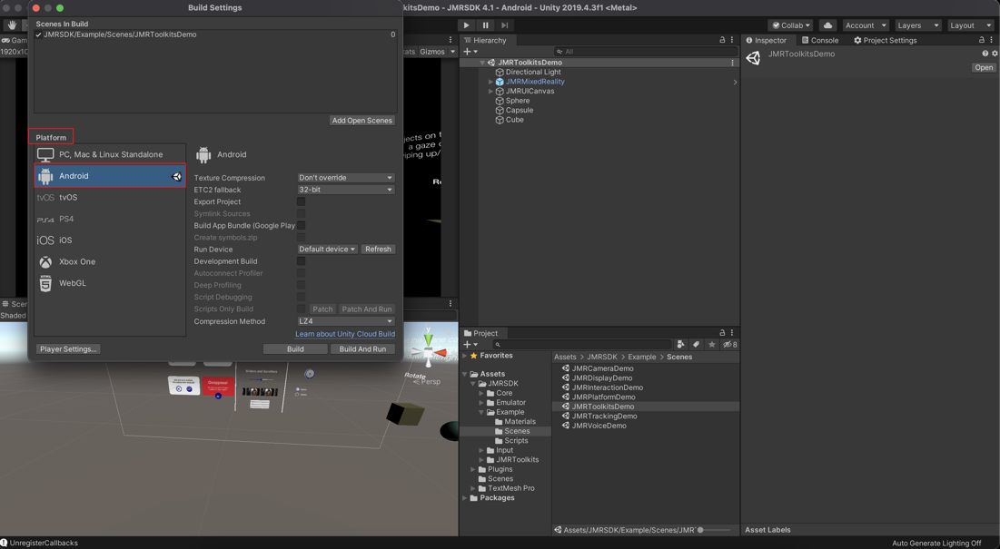
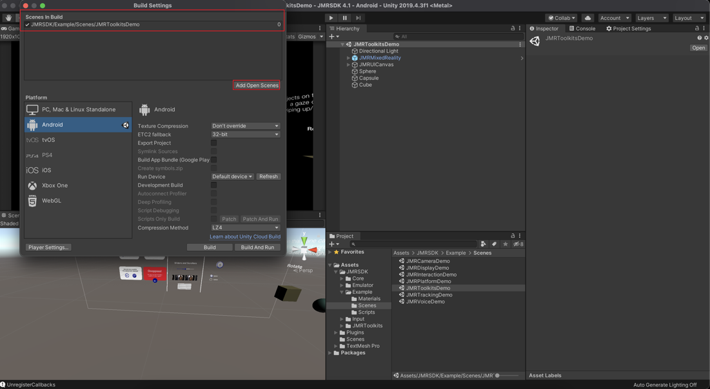
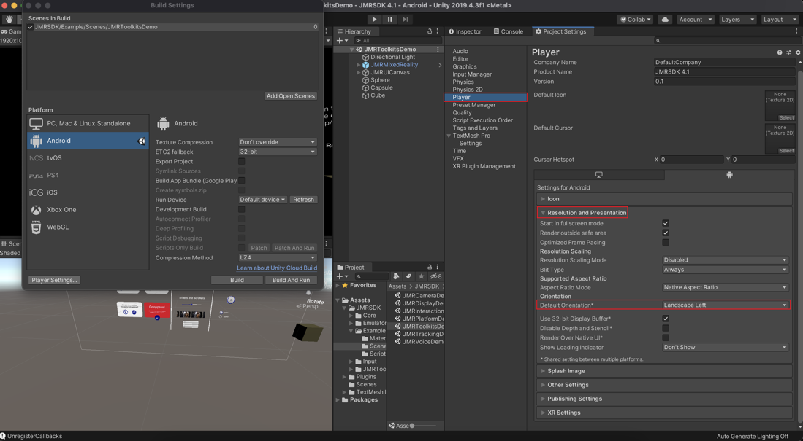
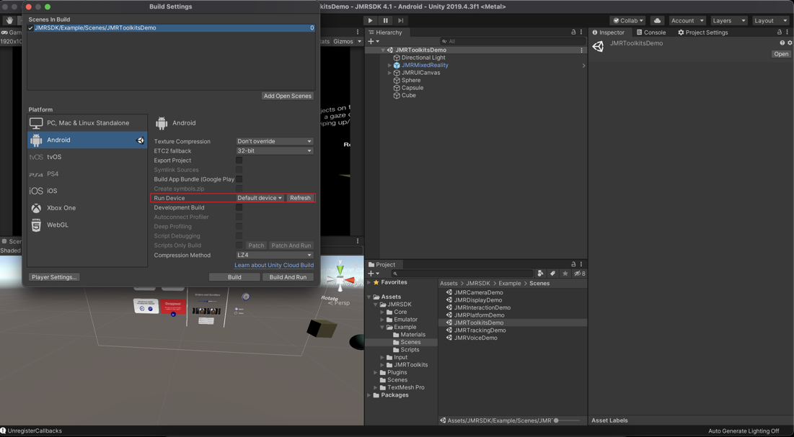

# Building to Target Device

In this section, we will look at the steps to build your application for **JioGlass**.

### Setting up Unity for Target Device

* Go to **File -> Build Settings** to open the **Build Settings** dialogue box.

* In Platform under Build Settings, Choose **Android** and click on **Switch Platform** if not done already as the destination platform.

* Ensure your scene(s) are added to the **Scenes in the Build** section. If not, then open your current scene(s) in the unity editor and click on Add Open Scenes under build settings. You can also drag and drop your scene into the build settings window.

* Click on **Player Settings** to configure the player settings for your target device.

### Player Settings

Ensure that your Target Device and the Development System are configured to build for Android.

#### Configure the Player Settings as shown below for Android Device

* Under the **Resolution and Presentation** tab, set the **Default Orientation** to **Landscape Left**.

* Under the **Other Settings** tab, set the **Graphics APIs** to **OpenGLES2**, and remove all others.

* Under the **Other Settings** tab, deselect the **Multithreaded Rendering**.

* Under the **Other Settings** tab, set the **Minimum API Level** to **Android 8.0 (API Level 26)** or above and **Target API Level** to **anything above Android 8.0**.

* Plugin your Target Android device into your Development System.

* Build the Application.

#### Running the Application

* Run the build on your Android Device.
* Insert your phone into the **Holoboard** such that the phone’s top side is facing the left side while the screen is facing away from you.

* Enjoy.
