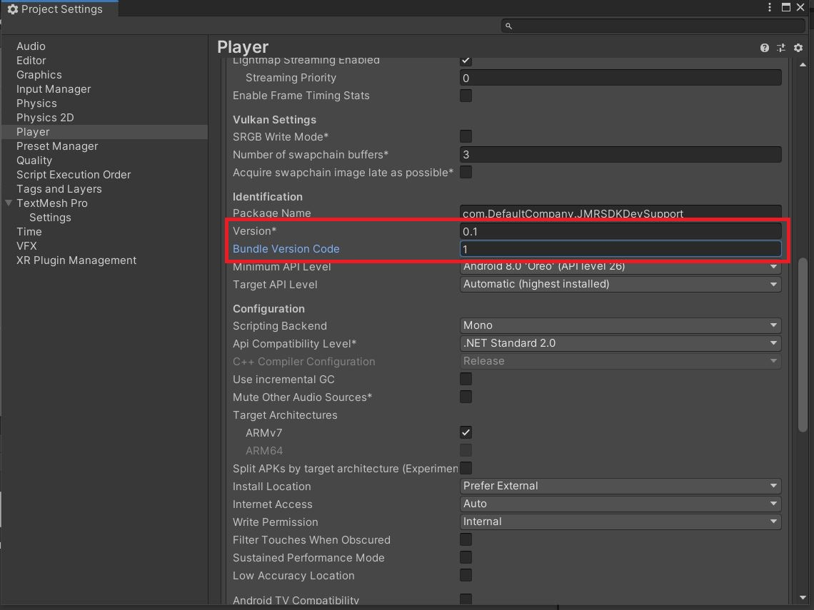

# Signing App for App Store


**How to sign an APK**

To sign an APK for publishing please follow the following steps:

1\.       Go to the Player Settings. You can go there via Edit > Project Settings > Player


Always set your version to new updated version while updating your app.


.png>)

2\.       Go to Publishing Settings and Select Keystore Manager.

.png>)

3\.       Select Keystore > Create New > In Dedicated Location to generate a new Keystore.

.png>)

4\.     Select a location to store the Keystore and click Save.

.png>)

5\.       Enter a password for your Keystore. Password must be at least 6 characters long.


**Note:** Make sure to remember the password. **Do not** lose this password.


6\.       Enter your Alias, Password, Validity (Keep it 50 years), First and Last Name, Organizational Unity, Organization, City, State, and Country Code.


**Note:** Make sure to remember the password. **Do not** lose this password.


.png>)

7\.       Click on Add Key.

8\.       Select Yes.

.png>)

9\.       Your APK is now signed. You can verify your alias here.

.png>)


Always Increase your version on every consecutive build and increase your version code on every consecutive release on the App Store.


10\.     Increase your **Version** and **Bundle Version Code** on every consecutive build and consecutive release on the App Store.

