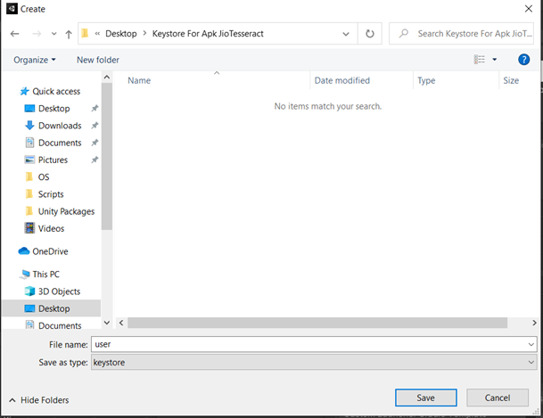

# FAQs - iOS

## Unity

### Mono Screen

#### The application is rendered in mono-screen instead of split screen

Make sure to have an instance of JMRAnalyticsManager present at all times.


[upgrade-guide-4.35.8.md](../../master/changelog-4.35.8/upgrade-guide-4.35.8.md)


Check if the JMRSDK core was imported correctly; if it is shown that some file is new (other than AgoraEngine and ScreenCast) when trying to import again that means the SDK Core has to be imported again.

### Build Failed

The application is failing to build

Goto Project Settings > Player > Microphone usage description > Make sure the "description" is not empty.

## XCode

### Build failed

#### Due to Pods

If in the application project directory, there exists PodFile as shown. Follow the steps below.

<figure><figcaption></figcaption></figure>

1. Open a terminal in the project directory.
2. Write the command `pod install` in the terminal and let it run until the command is completed
3. Run the <mark style="color:yellow;">Unity-iPhone.workspace</mark> instead and proceed normally.

#### Due to Third-Party Packages

Make sure to update your third-party packages (eg. Photon). If you still get errors please refer to third-party package iOS documentation or contact them.
