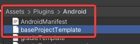
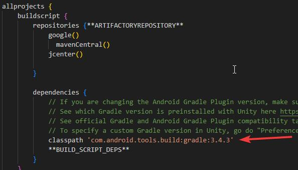

# Gradle

## Gradle Compatability

The following table shows the compatibility between Gradle version and Unity version.

<table><thead><tr><th width="334.3333333333333">Unity version</th><th width="151">Gradle version</th><th>Android Gradle Plugin version</th></tr></thead><tbody><tr><td>2023.1, 2023.2</td><td>7.6</td><td>7.3.1</td></tr><tr><td>2022.2, 2022.3</td><td>7.2</td><td>7.1.0</td></tr><tr><td>2022.1 2021.2, 2021.3 2021.1 starting from 2021.1.16f1 2020.3 starting from 2020.3.15f1</td><td>6.1.1</td><td>4.0.1</td></tr><tr><td>2021.1 up to and including 2021.1.15f1 2020.1, 2020.2 2020.3 up to and including 2020.3.14f1</td><td>5.6.4</td><td>4.0.1</td></tr><tr><td>2019.4</td><td>5.1.1</td><td>3.4.3</td></tr></tbody></table>



## Setting the correct Android Gradle Plugin version.

To setup the correct version of the Android Gradle plugin version -

1.  Open baseProjectTemplate.gradle

    
<figure><figcaption></figcaption></figure>

2. Change the version of 'com.android.tools.build.gradle'

<figure><figcaption></figcaption></figure>

## Gradle build failure.

While building if you get Gradle Build failure, you will get multiple error logs in the unity console. There can be multiple reasons why you are getting these errors.


For getting the reason you need to refer to CommandInvocationFailure in Build failed logs


<figure><figcaption>
CommandInvocationFailure in unity console
</figcaption></figure>

###

### #1 Error: uses-sdk:minSdkVersion 'x' cannot be smaller than version 26 declared in library

<figure><figcaption></figcaption></figure>


JMRSDK has a dependency on SDK version 26 and hence build will fail when the minimum API version specified in project settings will be smaller than version 26.


**Fix:** Make sure that the minimum API level is set to 26 and the target API level is set to 29 or higher.

<figure><figcaption></figcaption></figure>

### #2 Error: Could not get unknown property 'vstsMavenAccessToken' for Credentials \[username: tesseractimg].

<figure><figcaption></figcaption></figure>


There are dependencies of the Gradle properties template on the base Gradle template.&#x20;


**Fix:** Make sure to select all the publishing build settings correctly as shown in the image below.

<figure><figcaption></figcaption></figure>

### #3 Error: Keystore passwords incorrect

<figure><figcaption>
Project Keystore incorrect
</figcaption></figure>

<figure><figcaption>
Project Key password was incorrect
</figcaption></figure>


This document does not cover manifest merger failure due to multiple manifest files injected due to third-party plugins.

