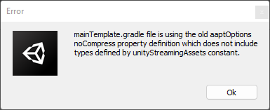

# Old aaptOptions error fix

If you got an error related to the old aaptOptions while making the build like this. Here is the fix:

<figure><figcaption></figcaption></figure>

Find the "mainTemplate" file inside your project window Assets->Plugins->Android

<figure><figcaption></figcaption></figure>

Open "mainTemplate.gradle" using notepad and add line&#x20;

"noCompress = \['.ress', '.resource', '.obb'] + unityStreamingAssets.tokenize(', ')"

&#x20;under the heading "aaptOptions" as highlighted in the screenshot

<figure><figcaption></figcaption></figure>
