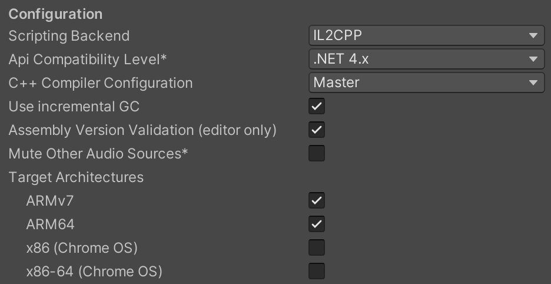
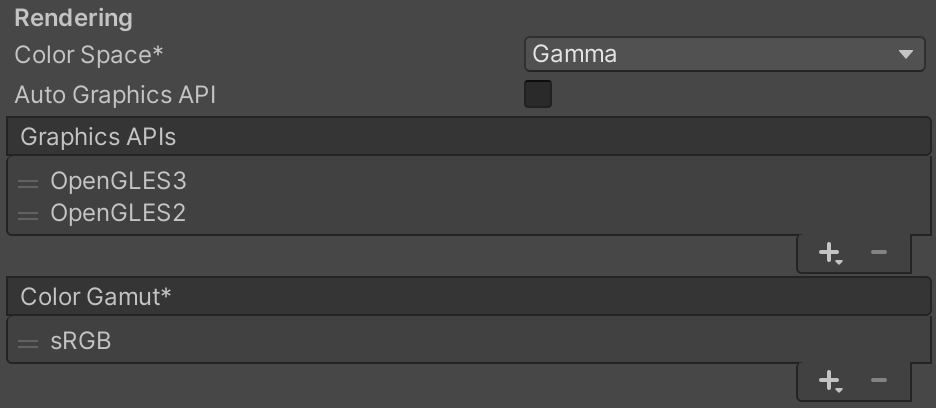

# Performance Optimization

### IL2CPP Scripting Backend Support

All JMRSDK APIs are now compatible with IL2CPP Backend. With this type of compilation, in which Unity compiles code specifically for a target platform when it builds the native binary, is called ahead-of-time (AOT) compilation. The Mono compiles code at runtime, with a technique called just-in-time compilation (JIT).\
\
Also, with IL2CPP you will also be able to latest arm64 architecture for the best performance of your application.\
\
You can apply this configuration in the Project Setting section of your Unity Editor.

<figure><figcaption>
Recommended Settings for Scripting Backend Configration
</figcaption></figure>


IL2CPP and ARM64 have a memory crash on some Unity Release. Use this [Issue Tracker](https://issuetracker.unity3d.com/issues/android-il2cpp-empty-project-crashes-on-launch-with-using-memoryadresses-from-more-than-16gb-of-memory-messages) to track the supported versions.

Issue is Fixed on

2018.4.30+\
2019.4.15+\
2020.1.14+\
2020.2.0b12+\
2021.1.0a4+\
**Recommended Version: 2019.4.40f1**



IL2CPP increases build times by 2X-5X. You can use Mono for faster development and IL2CPP for final optimized releases.


### OpenGLES3 Support

OpenGLES3 Graphics API is supported and should be placed above OpenGLES2 for preference.

<figure><figcaption>
Reccomended Settings for Grapics APIs Settings
</figcaption></figure>

### Multithreading Support

JMRSDK APIs are now threadsafe and compatible with Unity Multi-threading Rendering Settings **(Except Camera and Mediaplayer)**

<figure><figcaption>
Recommended Settings
</figcaption></figure>


Apps using **Camera and Mediaplayer** provided in JMRSDK need to disable multithreading rendering settings.

