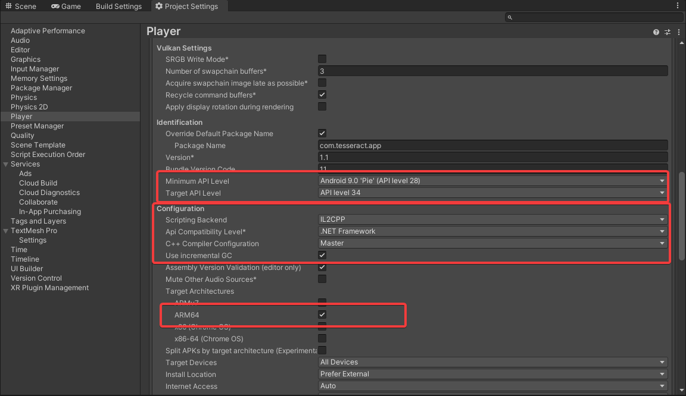

# Upgrade Guide For v4.24.6


Before importing a new package, please delete the Packages folder from your project folder, this is a probable fix for missing references from SDK prefabs.



JMRSDK 4.24.6 is a Mandatory Update for all Developer Applications to function with the latest JioGlass Ecosystem

* Your Application will not be listed on the JioGlass Application Store if not upgraded to JMRSDK 4.24.6.
* Please read the [New Feature Released](upgrade-guide-from-previous-version.md#new-features-released) below carefully
* Please refer to the section - [Configuring your Project for JioGlass Lite](../getting-started/setting-up-a-jio-mixed-reality-project-in-unity.md#configuring-your-project-for-jioglass-lite) and follow the steps to configure your project for JioGlass Lite Ecosystem
* Please refer to the section - [Adding Category Tag In AndroidManifest](../getting-started/setting-up-a-jio-mixed-reality-project-in-unity.md#adding-category-tag-in-androidmanifest) to ensure that your application is reflected within the same category as it is uploaded on the developer console.
* Please refer to the section - [Publishing your Application Listing on the Developer Console for JioGlass Lite Ecosystem](../publish/publishing-to-jioglass-developer-console.md)
* Developers are recommended to update their tutorial graphics with Virtual Controller by checking which Interaction device is active. Refer to the section [Virtual Controller with Keyboard](../interaction/virtual-controller-virtual-keyboard-for-jioglass.md) below for more information



Important notice for users upgrading to JMRSDK 4.12.4+ from any previous versions

* JMRInputField needs to be updated with the new prefab
* Toolkit v1 has been deprecated from JMRSDK 4.12.4, please upgrade to Toolkit v2 to enjoy the latest features and upgrades


## **JMRDraggable component**

All existing custom-scrolls, sliders and all other draggable objects should have a JMRDraggable.cs script component on them.

1\.  Select ViewPort of existing CustomScrolls or Sliders.

2\.  Add component “JMRDraggable.cs” on it.


\
**Laser Pointer not visible fix**
---------------------------------

If Pointer does not appear after importing, please follow the steps given in LaserRayFix

Go to Asset > JMRSDK > Core > Prefabs > Pointers > JMRLaserPointer and check in the inspector.

1. Set LineMaterial to LaserPointerMatUnlit
2. Set Line Renderer to JMRSDK > Core > Prefabs > Pointers > JMRLaserPointer.
3. Set Width Multiplier to **0.04**.
4. Set Line Number Steps to **20**.


**Mandatory**: Configure System UI in all applications before building your app.


## **Configure System UI**

From the menu, select


JioMixedReality > SystemUI > UpdateSortedLayer

.png>)

## **Recenter Application on Resume**&#x20;

It is set to true by default to recenter the view.

.png>)

## Old aaptOptions error fix

If you found error related to the old aaptOptions while making the build

<figure><figcaption></figcaption></figure>

Find the "mainTemplate" file inside your project window Assets->Plugins->Android

<figure><figcaption></figcaption></figure>

Open "mainTemplate.gradle" using notepad and add line&#x20;

"noCompress = \['.ress', '.resource', '.obb'] + unityStreamingAssets.tokenize(', ')"

&#x20;under the heading "aaptOptions" as highlighted in the screenshot

<figure><figcaption></figcaption></figure>

## Controller Renders

For [Lite Version](https://tesseractpvt-my.sharepoint.com/:f:/g/personal/virendra_tesseract_in/EoFrakY5K7RBkZv8zioMXIUBgzA6RP86w7-_bIG2-C624w?e=WNzhuS)

For [Pro Version](https://tesseractpvt-my.sharepoint.com/:f:/g/personal/developer_tesseract_in/Evuu0GmE1RZFgjA7UY2ASAsB3eJTaq82aYp_PG-iY6zg9w)

