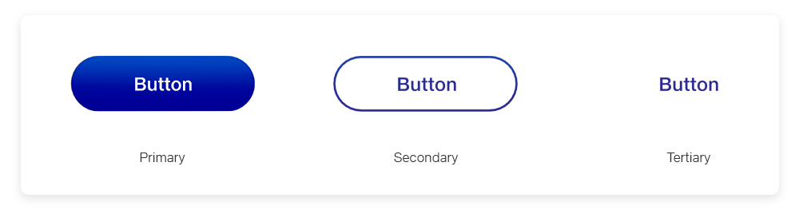
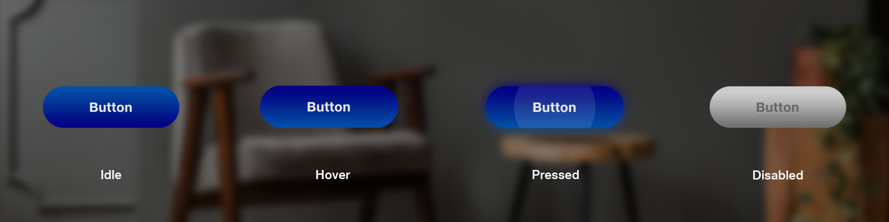
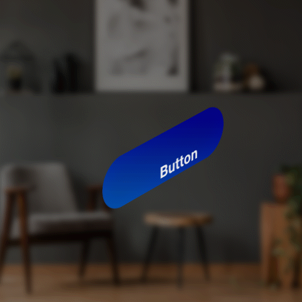
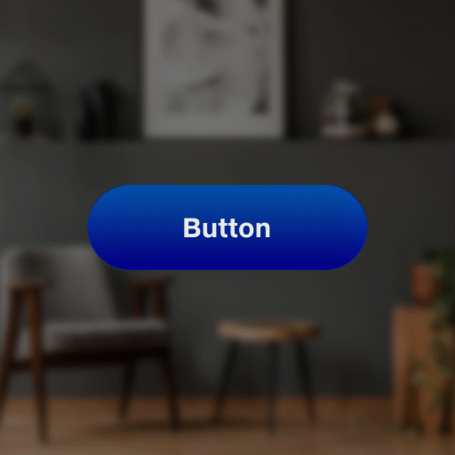
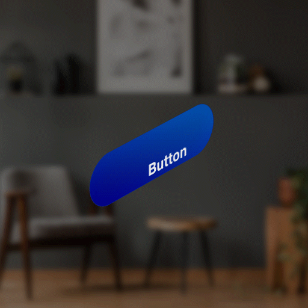
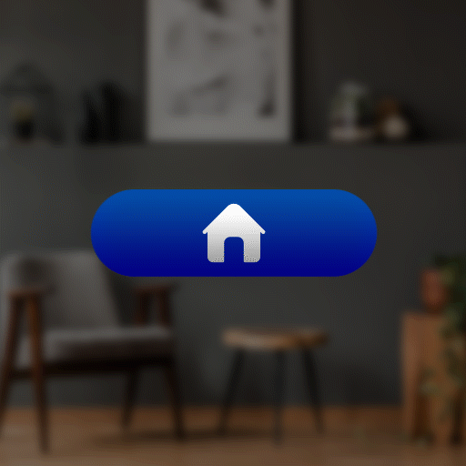
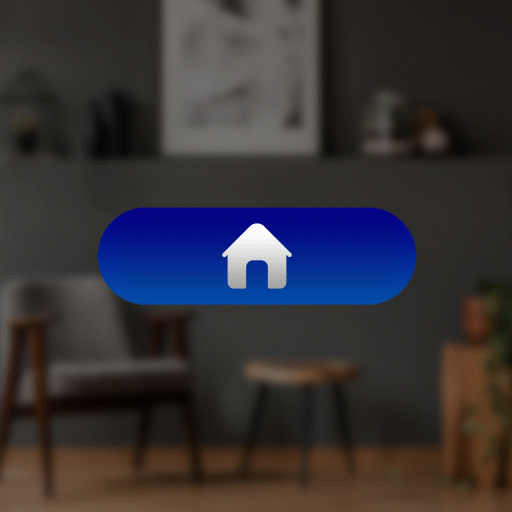
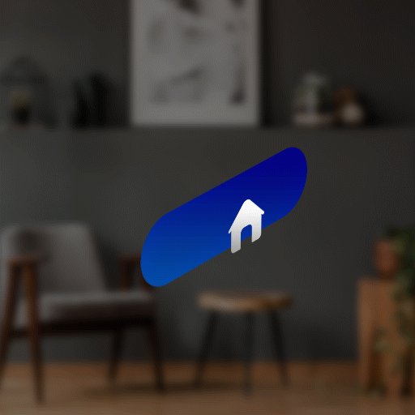
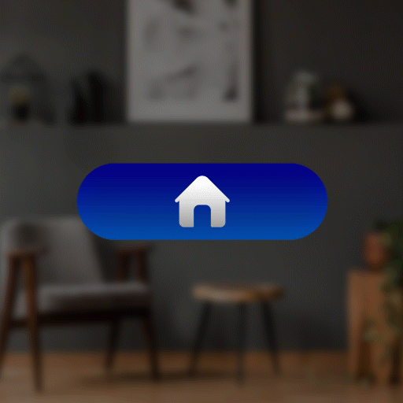

# Button

Buttons give people a way to trigger an action. They’re typically found in forms, dialog panels, and dialogs. Some buttons are specialized for particular tasks, such as navigation, repetitive actions, and presenting menus.

## Best practices

### Layout

* For dialog boxes and panels, where people are moving through a sequence of screens, **right-align buttons** with the container.
* For single-page forms and focused tasks, **center-aligned** primary buttons are used.
* Always place the **primary button on the right**, and the **secondary button to the left**.
* Show only one primary button that inherits theme color at rest state. If there are more than two buttons with equal priority, all buttons should use the primary button.
* Don't place the default focus on a button that destroys data. Instead, place the default focus on the button that performs the "safe act" and retains the content (such as "Save") or cancels the action (such as "Cancel").

### Content

* Use sentence-style capitalization (capitalize the first word only)
* Ensure it's clear what will happen when people interact with the button. Be concise; usually a single verb is best. Include a noun if there is any room for interpretation about what the verb means. For example, "Delete folder" or "Create account".

#### **Call to Action (CTA / C2A)**

A call to action button, depending on the situation, will usually prompt users to sign up/register/buy now/etc. CTA buttons should be used where the platform wants to strongly suggest something that the user should do.


Use **primary button** as shown below for CTA


#### **Primary action**

CTA button and a primary button can look the same because primary buttons should be a strong visual indicator to help the user complete their journey. Primary buttons should be used in situations where the user may want to go ‘next’, ‘start’, ‘add’, etc.


Use **primary button** as shown below for CTA


#### &#x20;**Secondary Action**

Secondary buttons are the ‘go back’ to the primary button’s ‘next’, or the ‘cancel’ button to the ‘submit’ button. Secondary buttons are the alternative we give users to the primary action.


Use **secondary button** as shown below for secondary action


#### &#x20;Tertiary A**ction**

Tertiary buttons are usually used for miscellaneous actions: the action is important, but may not be what the user is looking to do. It means things like ‘add new’, ‘edit’, or ‘delete’, provided that they aren’t a primary action.


Use a **tertiary button** as shown below for tertiary action


* **Primary button -** Filled buttons have more emphasis, as they use a color fill and shadow.
* **Secondary Button** - Outlined buttons are used for more emphasis rather than text buttons due to the stroke.
* **Tertiary button -** Text buttons are typically used for less important actions.

## Text Button

### **States**

### Transitions

| **Transitions** | **Front View**                                                                    | **Isometric View**                                                                |
| --------------- | --------------------------------------------------------------------------------- | --------------------------------------------------------------------------------- |
| **Appear**      | 

    | 

    |
| **Enter**       | 

 | 

 |
| **Exit**        | 

  | 

  |
| **Interact**    | 

 | 

  |
| **Disappear**   | 

 | 

 |

## Image Button

### States

.png>)

### Transitions

| **Transitions** | **Front View**                                                                         | **Isometric View**                                                                     |
| --------------- | -------------------------------------------------------------------------------------- | -------------------------------------------------------------------------------------- |
| **Appear**      |                                   | .gif>)                            |
| **Enter**       |                                    | .gif>)                             |
| **Exit**        | 

 | 

 |
| **Interact**    | 

    | 

    |
| **Disappear**   | .gif>)                         | .gif>)                         |

## How to make your Tesseract Mixed Reality Button

The JMRTK buttons are defined as a layers that allow the perception of depth using flat 2D elements by adding gutter (gap) between the layers as shown below:

### **Example of layers in a Text Button**

### **Example of layers in a Toggle Button**

### Defining Layers for Color and Animation

To use animations and color system defined as part of JMRTK, your custom button must implement the following layers -

**Primary Plate:** Represents the Main Color

**Mask Plate:** Used to add gradient effect to the primary color

**Glow Plate:** Glow Plate becomes active when a user clicks on a button. It shows a blink effect

**Press Plate:** Whenever a button is pressed, this animated circle plate is used to represent the click interaction and gives user feedback that the button is pressed.

These are Animated and work on a click as shown in the example below:

