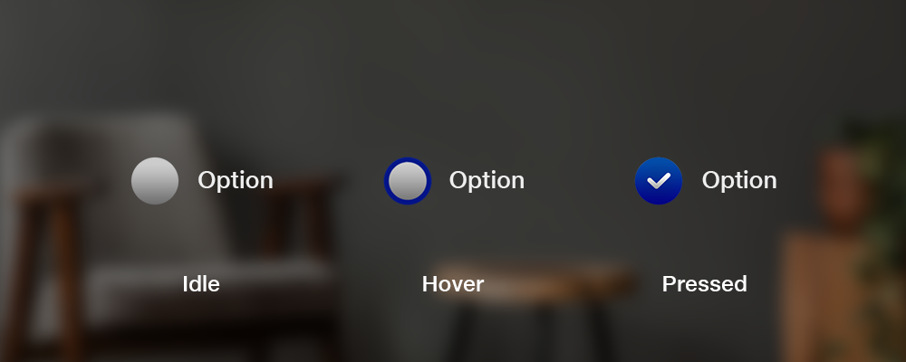

# Check Box

Check boxes give people a way to select one or more items from a group, or switch between two mutually exclusive options (checked or unchecked, on or off).

## Types of Checkbox

* Single check box
* Multiple check boxes

## Best practices

### Layout

* Use a single check box when there's only one selection to make or choice to confirm. Selecting a blank check box selects it. Selecting it again clears the check box.
* Use multiple check boxes when one or more options can be selected from a group. Unlike radio buttons, selecting one check box will not clear another check box.

### Content

* Separate two groups of check boxes with headings rather than positioning them one after the other.
* Use sentence-style capitalization (only capitalize the first word).
* Make it easy for people to understand what will happen if they select or clear a check box.

## CheckBox

### &#x20;States

### &#x20;Transitions

| **Transitions** | **Front View**                                                                                                                                                                                | **Isometric View**                                                                                                                                                                            |
| --------------- | --------------------------------------------------------------------------------------------------------------------------------------------------------------------------------------------- | --------------------------------------------------------------------------------------------------------------------------------------------------------------------------------------------- |
| **Appear**      |     |                                                                                                                                     |
| **Enter**       |      |      |
| **Exit**        |       |       |
| **Interact**    |   |   |
| **Disappear**   |  |  |

## Vertical Group Layout

### States

### Transitions

| **Transitions** | **Front View**                                                                                                                                                                               | **Isometric View**                                                                                                                                                                           |
| --------------- | -------------------------------------------------------------------------------------------------------------------------------------------------------------------------------------------- | -------------------------------------------------------------------------------------------------------------------------------------------------------------------------------------------- |
| **Appear**      |     |     |
| **Enter**       |      |      |
| **Exit**        |       |       |
| **Interact**    |   |   |
| **Disappear**   |  |  |

## Horizontal Group Layout

### States

