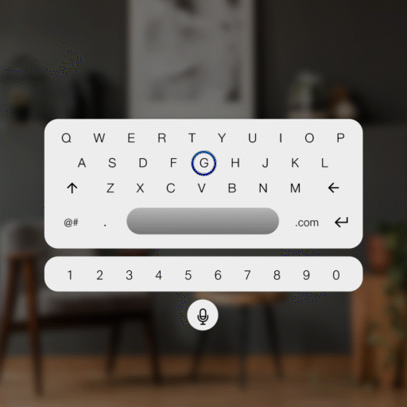

# Keyboard

Text input in Mixed Reality is always the most challenging form of input due to a lack of dedicated physical keyboard as a hardware accessory. Tesseract provides an easy-to-use virtual keyboard that manages its own lifecycle while interfacing with an input field. However, it is recommended to use the voice input for text input wherever possible.

## Best practices

### Layout

* The keyboard always shows up in front of the user by default
* The keyboard is placed in the lower hemisphere of the user's periphery to help in aiming while using either gaze or controller pointing interface

### Content

* The keyboard has different modes for alpha-numeric and special character inputs
* These modes can be toggled using the special characters key on the bottom left
* The keyboard also has an additional button for activating voice input

## Keyboard

### States

.png>)

.png>)

### Transitions

| Transitions   | **Front View**                                                                      | **Isometric View**                                                                  |
| ------------- | ----------------------------------------------------------------------------------- | ----------------------------------------------------------------------------------- |
| **Appear**    | 

    | 

    |
| **Enter**     | 

     | 

     |
| **Exit**      | 

      | 

      |
| **Interact**  | 

  | 

  |
| **Disappear** | 

 | 

 |
