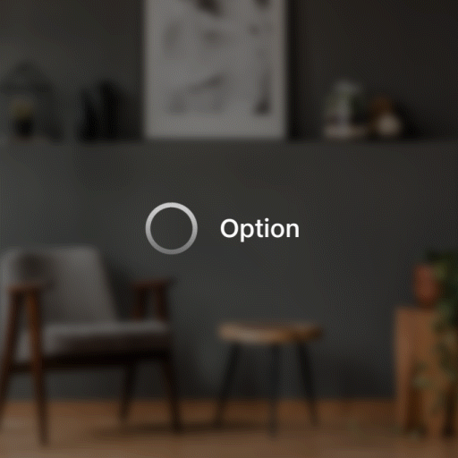
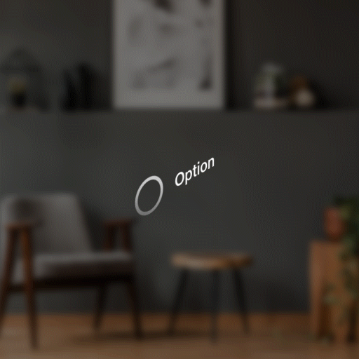
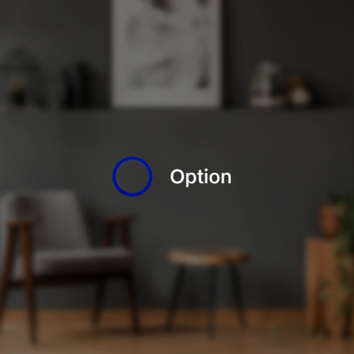
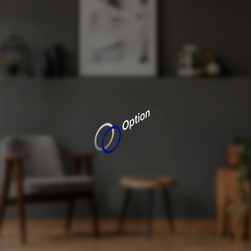

# Radio Button

Radio buttons let people select a single option from two or more choices.

## Best practices

### Layout

* **Use radio buttons when there are two to seven options,** you have enough screen space, and the options are important to be good use of that screen space.
* If there are **more than seven options, use a drop-down menu instead.**
* To give people a way to select more than one option, use check boxes instead.
* If a default option is recommended for most people in certain situations, use a drop-down menu instead.
* Align radio buttons vertically instead of horizontally, if possible. Horizontal alignment is harder to read and localize. If there are only two mutually exclusive options, combine them into a single check box or toggle. For example, use a check box for "I agree" statements instead of radio buttons for "I agree" and "I disagree".

### Content

* List the options in a logical order, such as most likely to be selected to the least, simplest operation to most complex, or least risk to the most. Listing options in alphabetical order isn't recommended because the order will change when the text is localized.
* Select the safest (to prevent loss of data or system access), most secure, and most private option as the default. If safety and security aren't factors, select the most likely or convenient option.
* Use a phrase for the label, rather than a full sentence.
* Make sure to give people the option to not make a choice. For example, include a "None" option.

## Radio Button&#x20;

### States

.png>)

### Transitions

| Transitions                    | **Front View**                                                                         | **Isometric View**                                                                     |
| ------------------------------ | -------------------------------------------------------------------------------------- | -------------------------------------------------------------------------------------- |
| **Appear**                     | 

    | 

    |
| **Enter / Hover /Highlighted** | 

     | 

     |
| **Exit**                       | 

      | 

      |
| **Interact / Pressed**         | 

  | 

  |
| **Disappear**                  | 

 | 

 |

## **Vertical Group Layout**&#x20;

.png>)

## **Horizontal Group Layout**

.png>)
