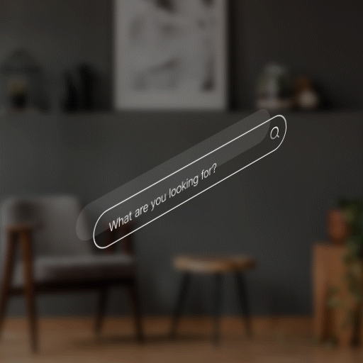

# Search Bar

## Best practices

### Layout

* Don't build a custom search control based on the default text box or any other control.
* Use a search box without a parent container when it's not restricted to a certain width to accommodate other content. This search box will span the entire width of the space it's in.

### Content

* Use placeholder text in the search box to describe what people can search for. For example, "Search", "Search files", or "Search contacts list".
* The search toolkit allows the users to search across different scopes as described below
  * **Global**: Searches across multiple sources of apps, cloud and local content. This is supported by deep search where results are obtained from within different applications in context to those applications and presented for instant action.
  * **Local:** Search within the current application scope.
  * **Web**: Search a web index. Results include pages, entities, and answers.

## Search Bar

### States

.png>)

### Transitions

| **Transitions** | **Front View**                                                                    | **Isometric View**                                                                |
| --------------- | --------------------------------------------------------------------------------- | --------------------------------------------------------------------------------- |
| **Appear**      | 

    | 

 |
| **Enter**       | 

     | 

     |
| **Exit**        | 

      | 

      |
| **Interact**    | 

  | 

  |
| **Disappear**   | 

 | 

 |
