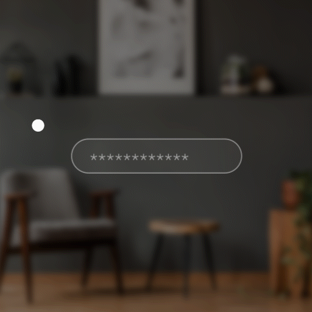
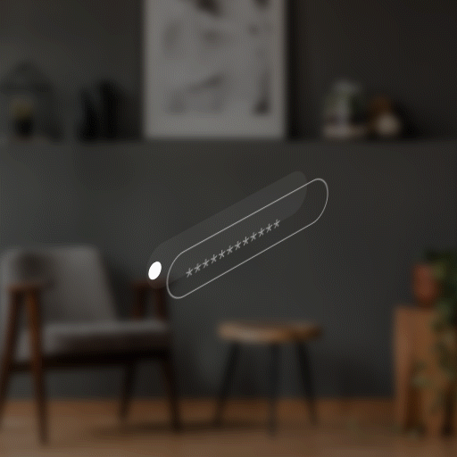
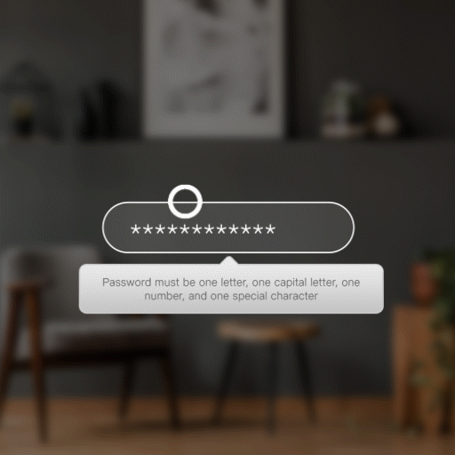
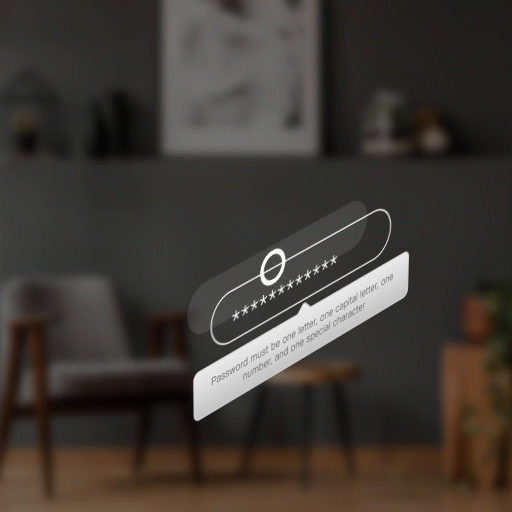

# Tool Tip

A good tooltip briefly describes unlabeled controls or provides a bit of additional information about labeled controls, when this is useful. It can also help customers navigate the UI by offering additional—not redundant—information about control labels, icons, and links. A tooltip should always add valuable information; use it sparingly.

There are two components you can use to display a tooltip:

* **Tooltip:** A styled tooltip that you can display on a chosen target.
* **TooltipHost:** A wrapper that automatically shows a tooltip when the wrapped element is hovered or focused.

## Best Practices 

### Content 

* Don’t use a tooltip to restate a button name that’s already shown in the UI.
* When a control or UI element is unlabeled, use a simple, descriptive noun phrase. For example: “Highlighting pen”. Only capitalize the first word (unless a subsequent word is a proper noun), and don’t use a period.
* For a disabled control that could use an explanation, provide a brief description of the state in which the control will be enabled. For example: “This feature is available for line charts.”

For a UI label that needs some explanation:

* Briefly describe what you can do with the UI element.
* Use the imperative verb form. For example, "Find text in this file" (not "Finds text in this file").

For a truncated label or a label that’s likely to truncate in some languages:\
(\*Truncated label - one that has been shortened)

* Provide the untruncated label in the tooltip.
* Don't provide a tooltip if the untruncated info is provided elsewhere on the page or flow.
* Optional: On another line, provide a clarifying description, but only if needed.

## Tooltip&#x20;

### **States**

.png>)

### Transitions

| **Transitions** | **Front View**                                                                                                                                                                                                                                                                                                                                                                                                                     | **Isometric View**                                                                                                                                                                                                                                                                                                                                                                                                                 |
| --------------- | ---------------------------------------------------------------------------------------------------------------------------------------------------------------------------------------------------------------------------------------------------------------------------------------------------------------------------------------------------------------------------------------------------------------------------------- | ---------------------------------------------------------------------------------------------------------------------------------------------------------------------------------------------------------------------------------------------------------------------------------------------------------------------------------------------------------------------------------------------------------------------------------- |
| **Appear**      | 

       | 

       |
| **Disappear**   | 

 | 

 |
