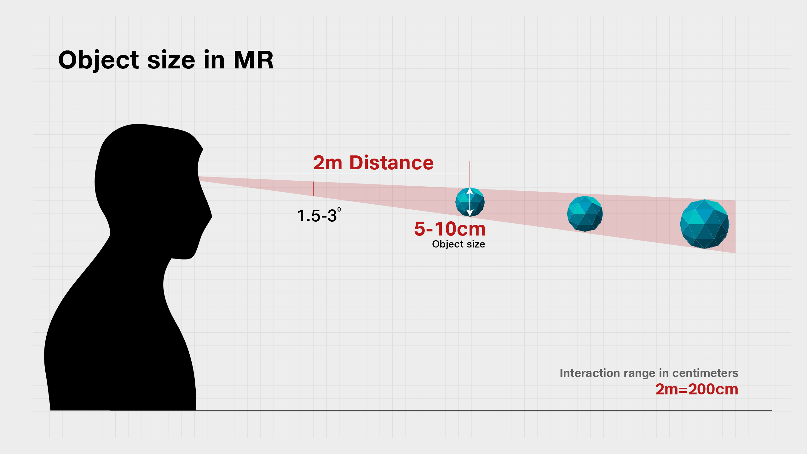
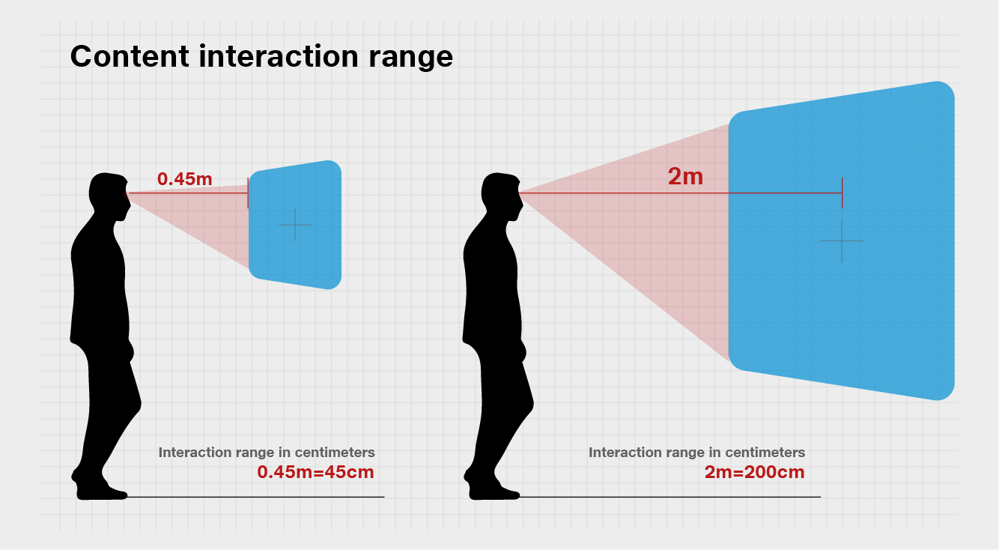

# Scale, Depth & Size

## Scale of Objects and Environments in Mixed Reality 

There are many ways to scale an object, some of which have possible effects on various other perceptual factors. The key one is to display objects in ‘true’ size, and maintain the realistic size as users move. This means holograms will take up different amount of a user’s visual angle as they come closer or move further away, the same way that real objects do.


Tesseract recommends that comfortable setting for viewing objects is **2m**, whereas the object size should not be less than **5cm**​ at **2m**


## Text size in Mixed Reality

Text in the physical and virtual world must be legible and readable. Text could be on a wall or superimposed on a physical object. It could be floating along with a digital user interface. Regardless of the context, we apply the same typographic rules for reading and recognition.

### Create clear hierarchy 

Build contrast and hierarchy by using different text sizes and weights. Defining a type ramp and following it throughout the app experience will provide a great user experience with consistent information hierarchy.

### Font Size Recommendations 

As you can expect, type sizes that we use on a PC or a tablet device (typically between 12–32pt) appear quite small at a distance of 2 meters. It depends on the characteristics of each font, but in general the recommended minimum viewing angle and the font height for legibility is around **0.35° - 0.4°/12.21-13.97mm** based on our user research studies. It is about **35-40pt** with the scaling factor introduced in text in Unity.


Tesseract recommends the following for placing content for choosing text size based on distance​

For near interaction at 0.45m(45cm), the minimum legible font's viewing angle and the height are 0.4°-0.5° / 3.14–3.9mm. It is about 9-12pt with the scaling factor introduced in Text in Unity.


### Minimum legible font size based on distance and viewing angle 

| **Distance**                        | **Viewing angle** | **Text height** | **Font size** |
| ----------------------------------- | ----------------- | --------------- | ------------- |
| 45cm (direct manipulation distance) | 0.4°-0.5°         | 3.14–3.9mm      | 8.9–11.13pt   |
| 2m                                  | 0.35°-0.4°        | 12.21–13.97mm   | 34.63-39.58pt |

### Comfortable legible font size based on distance and viewing angle 

| **Distance**                        | **Viewing angle** | **Text height** | **Font size** |
| ----------------------------------- | ----------------- | --------------- | ------------- |
| 45cm (direct manipulation distance) | 0.65°-0.8°        | 5.1-6.3mm       | 14.47-17.8pt  |
| 2m                                  | 0.6°-0.75°        | 20.9-26.2mm     | 59.4-74.2pt   |
