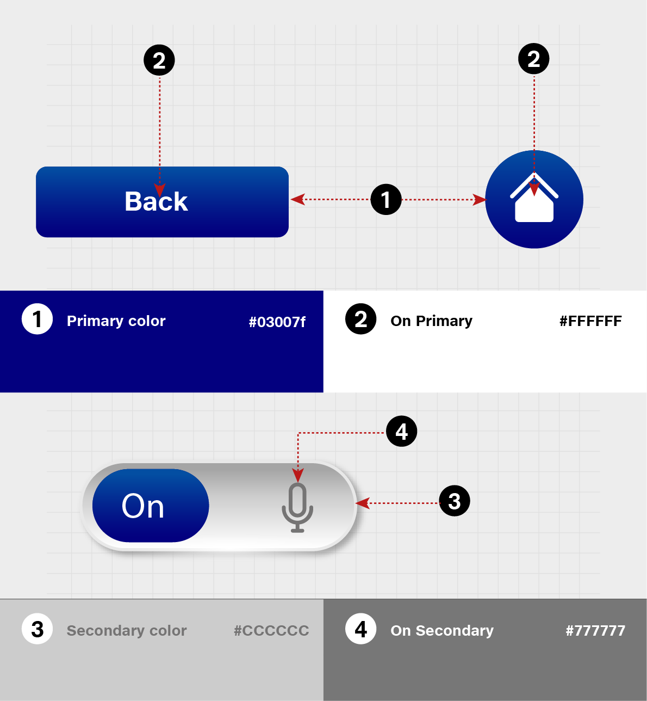
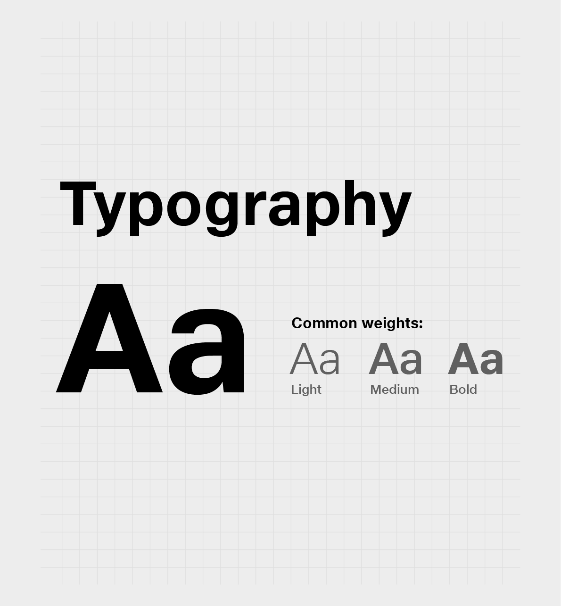
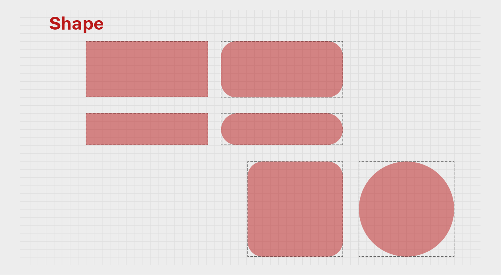

# Theme System

Themes help to customize our design to match the look and feel of our brand with built-in guidance for customizing **colors, typography and shapes.**

## **Color**

This color system is a structured approach to applying color to an UI.\
Global color styles have semantic names and defined usage in components – primary, secondary (brand colors), surface, background, and error.

Every color has a complementary color for elements placed “on” top of it to promote consistency and accessible contrast.&#x20;

## **Typography**

\
Important attributes of Typography, such as the typeface, font weight, and letter case, can be modified to match your brand and design.&#x20;

## **Shape**

\
Shape can help direct attention or identify components, communicate their state, and express your brand.

These global styles provide the user to quickly change the shape of similar-sized components in one go.&#x20;

## **Transition**

\
Transitions can help guide the user attention from one point to another through an animation. It gives intelligent feedback based on the user's behavior, keeps the UI feeling alive, and guides the user to navigation through your app.

